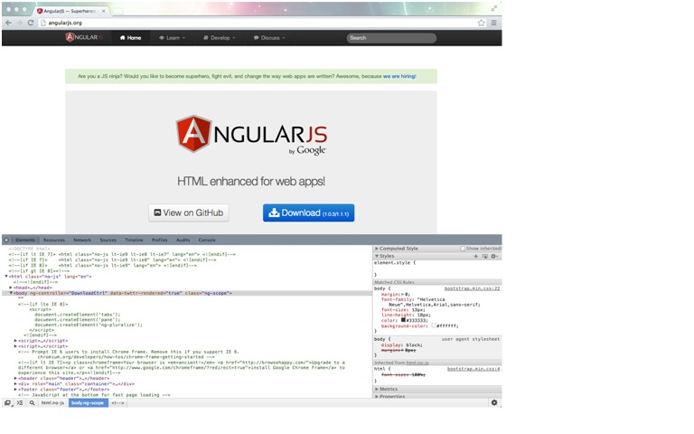

AngularJS即时入门
-----------------
欢迎阅读AngularJS即时入门，这是用AngularJS构建你的现代JavaScript应用程序的指南。这本书帮助你尽可能快速高效地使用AngularJS。您将学习基本的框架，学习如何将它塑造成一个MVC的源泉以及你需要知道的有关模板，数据绑定，模块，依赖注入，和指令的一切内容。
本文档包含以下几个部分：

**什么是AngularJS？：**找出AngularJS与其他JavaScript框架的区别，以及为什么它就是你的下一个项目最好的选择。

**Hello World:**了解如何获得和运行AngularJS，这样你就可以开始建设尖端的Web应用程序。

**快速入门-一个AngularJS的MVC应用：**重温Model-View-Controller范式，看看如何使用AngularJS建立一个快速，灵活的MVC应用程序。

**你需要了解的首要的5个特点：**通过其最突出的几个特点—模板，双向数据绑定，模块，依赖注入，和指令，我们来探索AngularJS的强大功能。

**你应该知道的人和网址：**结识杰出贡献者，博客，和AngularJS专家。访问有用的教程，论坛，文章和推特交流版的链接网址，将让你跟踪了解最新的关于AngularJS所有的资讯。 

那么，什么是AngularJS？
-----------------------
AngularJS是一个建设互动、单页的现代Web应用程序的JavaScript框架。

如果你正在读这本书，我敢打赌，你已经知道了。事实上，我敢打赌，你符合下面的描述之一：

 - 你是一位经验丰富的Web应用程序开发者，你已经有了一个JavaScript框架能为你做什么的好主意。你想知道AngularJS有什么特别的。
 - 你对JavaScript应用程序的开发还相对不熟悉，你已经注意到，有许多可用的JavaScript框架，但他们都看起来是一样的。你想知道AngularJS有什么特别的。
 
AngularJS确实很特别，我们稍后再说。但在此之前我们可以谈谈是什么使得AngularJS这么独特，让我们看看JavaScript框架一般都试图解决的问题：HTML构建交互式应用程序已经是非常糟糕了。

记住HTML是为静态内容设计的。不仅仅是从来没有打算支持丰富的应用程序,而且它还妨碍我们试图以更加流畅的方式采用网络。例如,在装载页面时，一次内容加载没有任何动态的的东西。

我们使用JavaScript已经走过了很长的路，在一定程度上CSS也是如此，但是HTML的Web仍然是立足的根本，无论对于我们打算建立的漂亮的、动态的用户界面是怎样不适，我们还是坚持使用下来了。

使用JavaScript框架，其目标是利用JavaScript的异步性，同时最大限度地减少了无情的静态HTML性质。这个问题有两种常见的方法。

首先是在HTML上加一层厚厚的JavaScript。这是一个双刃的剑；它是很好的不需要担心你的基于dynamic-JavaScript-land的动作如何映射到静态的HTML世界，但如果你不完全理解框架如何解释你的动作，那么这种做法非但无法在浏览器中正确的渲染，反而很容易变成性能的噩梦。

第二种方法是让开发者决定视图的创建，并提供了一层薄薄的JavaScript嵌入到这些视图。有较少的抽象，使得你的应用程序更难以性能下降，但如果该框架为HTML承担更少的责任，开发者将需要手动创建视图。

AngularJS采用第二种方法，而且更进了一步。而不是让AngularJS离开开发人员在标记和样式的世界中独自谋生，AngularJS与HTML集成来扩展视图的功能而且作为需要吸收了JavaScript的少量动态性。

关于AngularJS所有特别之处来自以下方法：

 - 视图抽象，可以让你直接在你的HTML中绑定模型对象，让框架照顾如何以及何时DOM模型对象将被更新
 - 来自性能命中的每一个抽象，但因为视图抽象是紧密结合在HTML中的，它通常比其他框架有很好的表现
 - 扩展HTML允许框架中添加功能，例如依赖注入，它允许你写可单元测试的视图

AngularJS整合和扩展的要求还有其他的好处。由于没有巨大的抽象来影响周围，你就可以在现有的Web应用程序中滴入AngularJS，并立即开始根据你的喜好或多或少的使用其功能；即使你已经使用了其他的JavaScript框架，你也可以这么使用AngularJS。

大多数的AngularJS功能都围绕于构建和延伸视图，以及视图和模型之间的交互。这会影响你在使用AngularJS工作时将如何花费你的时间，所以让我们来看看这两组分离的功能。

用户界面控制是声明式构建，使用基于HTML的模板和一个AngularJS称为指令的功能.。指令是AngularJS特有的。我们将在在这本书中后面深度介绍，但现在，把他们认作为一个动态的HTML扩展。使用模板和指令，可以重复使用，并促进你的HTML和CSS技能，同时还从JavaScript框架的帮助下绘制动态行为。

模型和视图交互是通过在你的HTML进行注释来处理的。正如我们刚才谈到的用户界面控制，这也是一个声明的过程。在运行前提前定义这些连接将让您可以充分利用强大的AngularJS功能，如数据绑定和依赖注入。随后在这本书中，我们介绍这些功能是如何工作的，以及他们如何可以帮助你建立一个强健和紧密结合的数据层。

AngularJS是一个令人兴奋的工作框架。它有利于集成和扩展过重的抽象，并鼓励Web应用程序开发的最佳实践，如模板和声明性数据建模。它提供了先进的功能，例如指令和依赖注入，允许您编写充分测试的应用程序——AngularJS的一个巨大的好处。这些功能在你建立一个互动性更强的网络时将节省您的时间和压力。

这本书将引导你了解你如何可以利用AngularJS的最好的部分。您将学习如何使用AngularJS建立一个功能强大、结构完善的应用程序，以及AngularJS为JavaScript框架带来的所有的主要增强功能和创新。

无论你是一位经验丰富的web应用程序开发人员，或者是一个完全的新手，你可以挑你需要的拥有AngularJS自信和风格的技能。

让我们开始吧！

Hello World 
-------------
现在，我们有一个什么是AngularJS的清晰认识，和一个有什么特别之处的模糊的概念，我们就可以开始使用它来建立伟大的事情！但是，伟大的事物都建立了坚实的基础之上，所以在我们研究一个简单的例子之前，让我们准备搭建开发环境。

AngularJS开发推荐工具 
---------------------
最低的限度，建立一个AngularJS的应用你只需要以下两个工具：

 - 一个文本编辑器
 - 一个Web浏览器

但如果我们想建立伟大的事情，我们将需要伟大的工具，没有最低限度。

AngularJS是一个对于正式开发和有正式开发工具的认真开发者的严肃框架。

让我们重温列表：

 - 一个文本编辑器
 - 一个良好的网络浏览器
 - 一个Web服务器
一个良好的网络浏览器应该有一个综合性的检查器和调试器，应该支持现代的HTML / JavaScript功能。所有主流浏览器的最新版本符合这些条件，所以只是确保你喜欢的浏览器是最新的。

例如，我目前使用的是OSX的最新版本的谷歌Chrome浏览器，其开发工具打开，它看起来像下面的截图：

一旦你有好的编辑器和浏览器，你需要一个地方来测试你的工作。为此，您可以直接在浏览器，但我要强烈建议您使用Web服务器有两个原因：

 - 现代浏览器不喜欢直接从您的硬盘驱动器运行文件,并且直接从磁盘运行时经常会限制你的应用程序。
 - 当你的应用程序开发完成，并公布给真实的客户使用和喜爱，它是要运行在Web服务器上。在非常类似于你的用户将会看到的环境中测试您的应用程序，它总是一个好主意。

设置本地Web服务器是不是特别困难，并有几个AngularJS的友好的工具，可以使您更容易设置。
Yeoman就是这样一种工具，可在https://github.com/yeoman获得。Yeoman为应用开发者提供了许多有用的功能，如应用程序开发包的管理和项目的脚手架。特别值得注意的是Yeoman服务器命令，这将启动本地Web服务器，可以承载您的AngularJS应用程序的。

angular-sprout是另一种选择，一个特定的AngularJS的自助工具。它提供了一个类似的功能集，并提供了通过Node.js（另一种有抱负的Web开发行家的方便工具）的Web服务器集成。你可以从https://github.com/thedigitalself/angular-sprout、http://nodejs.org分别得到这些工具。

  [1]: https://github.com/nexustap/AngularJS/blob/master/ebooks/Instant-AngularJS-Starter/images/0-1.jpg

  一个非常基本的AngularJS应用
---------------------------
我们所有的工具到位，我们就可以开始编码！就让我们投身而入。打开你的文本编辑器，快速的插入一个HTML框架如下： 

    <!DOCTYPE html>
    <html>
     <head>
      <title>Welcome to AngularJS</title>
     </head>
     <body>
      <h1>Hello, World.</h1>
     </body>
    </html>

> 下载示例代码
您可以用您在http://www.packtpub.com的账户下载您在Packt购买的所有书籍的示例代码文件。如果您在其他地方购买了这本书，你可以访问http://www.packtpub.com/support，并注册,有电子文件直接邮寄给您。

请记住使用合适的DOCTYPE。这不是AngularJS必需的，但它是非常重要的帮助网页浏览器正确地呈现内容。说到AngularJS，现在是时候添加框架了。为此，我们将它添加到文件头，如下面的代码片段所示： 

    <head>
        
        <title>Welcome to AngularJS</title>
    </head>

你会注意到我们从云上包含了AngularJS包，而不是下载，使用相对Url来包含它。这是非常好的 ，并建议以这种方式访问AngularJS。写这篇文章的当前版本是1.0.3，但你应该使用最新的版本AngularJS，这是可以在http://angularjs.org获取。我们还采用了非压缩后的版本，这是很好的发展，但生产，你应该使用压缩后的版本。

如果在你的网页浏览器运行我们目前的代码指向到你的web服务器，当然!你会看到一个非常基本的没有特殊AngularJS行为的HTML输出。您可以使用内置到您的浏览器的网页检查器验证AngularJS加载，但是，你可以看到，我们没有做任何事情。

让我们来修改下。首先，我们将添加一个简单的脚本到我们头上 

    <head>
        
        
        <title>Welcome to AngularJS</title>
    </head>

接下来，我们需要告诉AngularJS我们的应用。我们这样做是通过注解我们的HTML标签： 

    <html ng-app>

最后，我们将到一个段落标记撒上少许AngularJS戏法： 

    <body>
        <h1>Hello, World.</h1>
        

            The current time is {{currentTime | date:'h:mm:ss a'}}.
        

    </body>
    
现在，如果你运行的应用程序，你应该看到一条消息，标题下，告诉你当地时区的当前时间。它可能不是看起来不起眼，但它是你的第一AngularJS的应用程序，它为我们提供了一些重要的洞察如何建立AngularJS应用。

一个非常基本的AngularJS应用
---------------------------
我们所有的工具到位，我们就可以开始编码！就让我们投身而入。打开你的文本编辑器，快速的插入一个HTML框架如下： 

    <!DOCTYPE html>
    <html>
     <head>
      <title>Welcome to AngularJS</title>
     </head>
     <body>
      <h1>Hello, World.</h1>
     </body>
    </html>

> 下载示例代码
您可以用您在http://www.packtpub.com的账户下载您在Packt购买的所有书籍的示例代码文件。如果您在其他地方购买了这本书，你可以访问http://www.packtpub.com/support，并注册,有电子文件直接邮寄给您。

请记住使用合适的DOCTYPE。这不是AngularJS必需的，但它是非常重要的帮助网页浏览器正确地呈现内容。说到AngularJS，现在是时候添加框架了。为此，我们将它添加到文件头，如下面的代码片段所示： 

    <head>
        
        <title>Welcome to AngularJS</title>
    </head>

你会注意到我们从云上包含了AngularJS包，而不是下载，使用相对Url来包含它。这是非常好的 ，并建议以这种方式访问AngularJS。写这篇文章的当前版本是1.0.3，但你应该使用最新的版本AngularJS，这是可以在http://angularjs.org获取。我们还采用了非压缩后的版本，这是很好的发展，但生产，你应该使用压缩后的版本。

如果在你的网页浏览器运行我们目前的代码指向到你的web服务器，当然!你会看到一个非常基本的没有特殊AngularJS行为的HTML输出。您可以使用内置到您的浏览器的网页检查器验证AngularJS加载，但是，你可以看到，我们没有做任何事情。

让我们来修改下。首先，我们将添加一个简单的脚本到我们头上 

    <head>
        
        
        <title>Welcome to AngularJS</title>
    </head>

接下来，我们需要告诉AngularJS我们的应用。我们这样做是通过注解我们的HTML标签： 

    <html ng-app>

最后，我们将到一个段落标记撒上少许AngularJS戏法： 

    <body>
        <h1>Hello, World.</h1>
        

            The current time is {{currentTime | date:'h:mm:ss a'}}.
        

    </body>
    
现在，如果你运行的应用程序，你应该看到一条消息，标题下，告诉你当地时区的当前时间。它可能不是看起来不起眼，但它是你的第一AngularJS的应用程序，它为我们提供了一些重要的洞察如何建立AngularJS应用。

你需要了解的5个最关键的特性
---------------------------
每个框架都有区别于其他框架的一组功能。在本节中，我们将看到AngularJS的特殊功能。

知道如何使用这些功能将帮助您用AngularJS创建史诗性的应用：

 - 学习模板的内部运作将帮助你建立更强壮的视图
 - 掌握模块将帮助你把你的应用程序分解为智能的组件
 - 了解数据绑定将帮助您加强您的视图和他们互动的数据之间的关系
 - 挖掘依赖注入将帮助你组织你的控制器和他们依赖的组件， 
 - 观察在运行的指令，将帮助你建立强大的，可重复使用的视图组件

让我们开始使用模板。

模板
-----
我们已经知道有关模板 。我们在指南应用程序示例中使用了两个，一个用于我们本章视图，另外一个用在添加记录视图。但这些视图是怎么工作的呢？

我们知道，我们可以使用`$scope`，但在章视图中我们也看到了`$index`。是否有其它像这样的属性？

注释是什么？我们已经看到了一些有用的注释，但是除此之外我们还可以用什么的注释？
让我们开始讨论像`$scope`这样的属性和像`ng-repeat`这样的属性之间的差异。

有两种方法从一个视图来调用AngularJS。正如前面我们看到，在我们的章视图，我们可以使用双大括号，直接向用户输出： 

    <ul>
    <li ng-repeat='chapter in chapters | orderBy:"title"'>
    <h2>{{chapter.title}}</h2>
    
{{chapter.summary}}

    

    <a href='#/chapter/{{chapter.id}}'>
    {{chapter.notes.length}}
    note
    notes
    </a>
    | 

    <ul class='notes' ng-show='chapter.id == selectedChapterId'>
    <li ng-repeat='note in chapter.notes | orderBy:"id"'>
    
#{{$index}}

    
<a ng-click='onDelete(note.id)'>delete</a>

    
{{note.content}}

    </li>
    <ul>
    </li>
    </ul>

任何时候，我们使用双大括号请求AngularJS呈现一些特定位内容，并在页面上打印出来。例如，`{{chapter.title}}`将打印我们希望的范围里的本章对象标题，`{{ $index }}`会打印出我们在`ng-repeat`范围内的当前的位置。

你可能会奇怪，为什么当我们渲染的内容，如`{{$scope}}` 以及`{{$index}}`时需要指定美元符号($)，但是当我们渲染的内容如`{{chapter.title }}`时不用。这样做的原因是使内容如何在我们的视图可见。

如ng-repeat和ng-show注解可以在`$scope`范围内充分的访问任何东西。所以，当我们写ng-repeat='chapter in chapters'，AngularJS将遍历$scopechapter.title，并创建本地（对于视图）chapter对象。

内容的局部视图被称为没有美元符号。这就是为什么我们说{{chapter.title}}（正确的），而不是`{{$chapter.title}}`（不正确）。当我们添加一个美元符号，我们指定AngularJS的关键字如`$scope`或`$index`。这些不是我们定义的属性;他们是AngularJS内部属性。

所以，如果你使用AngularJS关键字正在渲染一些内容，请使用一个美元符号。如果你渲染的内容，已经被定义在你的视图中，不要用一个美元符号。

说起美元符号属性，我们只看到两个AngularJS关键字：`$scope`和`$index`。AngularJS还能提供给我们什么吗？

这些被分为两组：所有视图得到的默认属性，使用注解提供的属性。

$scope就是一个所有视图中默认情况下得到的属性的例子。这在AngularJS是少见的;只有几个属性，以这种方式暴露。

除了`$scope`，请允许我介绍`$id`和`$window`。`$id`将包含一个唯一的ID为当前作用域。自注释，如ng-repeat每次迭代产生一个新的子范围，我们可以用它来为每次迭代添加一个独特的句柄。例如，如果我们想给所有的章节标题一个唯一的ID，我们可以对我们的标题进行以下更改： 

    <h2 id='{{$id}}'>{{chapter.title}}</h2> 

`$window`将提供JavaScript的原生窗口对象的引用。建议总是使用AngularJS的`$window`，而不是JavaScript的窗口。这对测试是重要的，在测试环境中，`$window`可以适当存根。

另一种将AngularJS的关键字暴露到视图方式是通过注解。例如，ng-repeat的注解公开`$index`属性，其价值是其持当前我们要遍历的集合的位置。

ng-repeat还提供列表中的具体位置的布尔标志：

 - `$first`将只在第一次迭代时是true
 - `$last`将只在最后一次迭代时是true
 - `$middle` 是整个迭代中除第一次和最后一次迭代以外都是true
 
在AngularJS，ng-repeat是唯一的暴露额外关键字的注解。这仍然是一个重要的概念，因为在本节后面，当我们谈到指令时，我们将看到如何以这种方式创建我们自己的关键字。

视图只是故事的一半。让我们来快速浏览一下控制器，以及它们如何影响模板。

您可能还记得在我们的ChaptersController中几个美元符号的属性： 

    Guidebook.controller('ChaptersController',
    function ($scope, $location, $routeParams, ChapterModel,
    NoteModel) {
    var chapters = ChapterModel.getChapters();
    for (var i=0; i<chapters.length; i++) {
    chapters[i].notes = NoteModel.
    getNotesForChapter(chapters[i].id);
    }
    $scope.chapters = chapters;
    $scope.selectedChapterId = $routeParams.chapterId;
    $scope.onDelete = function(noteId) {
    var confirmDelete = confirm('Are you sure you
    want to delete this note?');
    if (confirmDelete) {
    $location.path('/deleteNote/' +
    $routeParams.chapterId + '/' + noteId);
    }
    };
    }
    );

在前面的章节，从我们在控制器讨论中我们知道`$scope`, `$location`和`$routeParams`是什么。控制器还能获取什么？ 

原来，相当多。实际上有十几个控制器可以访问的属性，其中大部分是比`$scope`, `$location`, 和 `$routeParams`更晦涩难懂。许多属性只是在非常特别的情况下才是必须的，但有一个我们没有看到的是值得引入的。

在指南应用程序示例中我们并没有解决本地化这个问题。这是一个必须为大多数现实世界的应用程序解决的。一般来说，你将要做到这一点，才可以进入你的视图，但如果有一些是地区依赖的最后的调整，例如为不同地区加载不同的标题图片这类修改，AngularJS可以使用`$locale`属性帮你解决。

`$locale`将返回用户的浏览器目前的语言环境。这可能是一个控制器中读取加载不同的字符串或图像，或设置，如果我们想改变语言环境，让用户选择。

一个需要明白的有关本地化的问题，当我们的主题是：如果你想允许多个语言环境，你应该从AngularJS：http://code.angularjs.org/1.0.0rc9/i18n-1.0.0rc9包括相应语言库。这将增加适当的默认的东西，如日期和时间格式。

让我们转换下，再仔细的看看注解。

之前我们已经看过一些这类注释。在我们的Hello World的例子中，我们使用了ng-controller将控制器绑定到我们的视图。我们的指南应用程序例子，向我们介绍了ng-app和ngview，这是我们用来指定我们的AngularJS的内容和视图在DOM中存放在哪里。视图章节教我们一些新的和非常有用的特性

 - ng-repeat重复遍历一个集合，为每次迭代创建一个内在的所有标记的副本
 - NG-show显示一个基于一个布尔条件的元素
 - ng-click在点击时调用一个函数
最后，我们的NoteController表明我们如何使用ng-model将数据发送到一个控制器。

正如我们刚才讨论的，注释往往创建本地视图的属性。例如，在我们的章节视图中ng-repeat创建了一个章节对象，该视图可以用来从特定章加载属性。

我们也看到ng-repeat创建了几个我们可以使用的本地的AngularJS对象：`$index，$first，$last`，和`$middle`。

我们还没有看到的东西是本地的注解的概念，只是在一个特定的父级注释的工作。例如，有ng-class-even和ng-class-odd注解。这些是用来给一个ng-repeat注解内的元素不同的类属性。如果我们想在我们的章节视图中让每个备注的背景颜色交替，我们可以用ng-class-even和ng-class-odd做到这一点，正如下面的代码片段所示： 

    <ul class='notes' ng-show='chapter.id == selectedChapterId'>
    <li ng-repeat='note in chapter.notes | orderBy:"id"'
    ng-class-even='"even"' ng-class-odd='"odd"'>
    
#{{$index}}

    
<a ng-click='onDelete(note.id)'>delete</a>

    
{{note.content}}

    </li>
    <ul>

现在偶数备注将得到偶数类型，奇数备注将得到奇数类型。如果我们增加了一些CSS给不同的背景颜色到ul.notes li.even和ul.notes li.odd，我们的备注将有交替背景色

还有另外一个组的注解，只能在特定父级内部使用： 

ng-switch-when和ng-switch-default可以在ng-switch里面使用。这可以让你在您的模板里建立一个switch语句。我们也可以这样做，而不是在我们的章节视图中使用两个ng-show注释： 

    <a href='#/chapter/{{chapter.id}}'>
    {{chapter.notes.length}}
    <ng-switch on='chapter.notes.length'>
    note
    notes
    </ng-switch>
    </a> 

对于一个大的项目列表ng-switch语法比使用ng-show和ng-hide更清晰。但是对于二态场景我更喜欢用ng-show和ng-hide而不是nng-switch，例如备注/多个备注问题，但实际上在我们的例子中还有一个更好的解决方案。注意看，在下面的代码片段给出的ng-pluralize用法： 

    <a href='#/chapter/{{chapter.id}}'>
    {{chapter.notes.length}}
    <ng-pluralize count='chapter.notes.length'
    when='{"1": "note", "other": "notes"}'>
    </ng-pluralize>
    </a>

ng-pluralize是专门用来处理多元化的问题，像我们的单备注相对于多或零备注。另外一个更清晰的语法，ng-pluralize也是有语义值，别人看你的代码，在看到ng-pluralize时，显而易见的就知道代码是做什么。

有几个其他有用的注释，在我们的指南应用程序示例中并没有使用。现在让我们看一些我觉得在使用AngularJS时非常有用。 

我们使用NG-click事件处理用户交互的几个地方。AngularJS还为鼠标事件提供了注解，如ng-mouse-enter和ng-mouse-move。作为一个经验法则，总是寻找一个在使用一个标准的JavaScript事件句柄前的AngularJS等价物。如$window一样，对于可测性这是更好的，它也将允许在你的控制器中指定一个处理函数，像我们使用ng-click和onDelete()函数一样。

AngularJS还提供了大量的包装形式和输入元素。ng-form标注和一个HTML的form是完全相同的，但它可以嵌套（HTML的forms是不能的）。输入元素可以扩展属性，如ng-required，ng-pattern。这些都是未来在HTML5标准的HTML输入元素，但AngularJS版本工作在一些旧版本的浏览器。如果你目标在于支持超过几十岁的浏览器，你应该总是使用任何HTML5的 ng- equivalents输入属性。

沿着相同的路线，AngularJS提供在HTML5中的其他HTML元素的功能，但在传统的浏览器可能无法正常工作。一些例子是ng-readonly，ngselected，和ng-disabled。像输入元素注解一样，这些工作就像他们的HTML5副本，有着在旧版本的浏览器中工作的好处。

另一个有趣的注解是ng-cloak。呈现网页时，在一次交互中浏览器就会呈现全部内容。构建复杂的动态应用时，我们往往在JavaScript中做了很多复杂的动态的东西，有时在最初页面加载后会溢出和发生。如果我们还在页面加载后调整我们的视图，这有时会在屏幕上产生内容类型的闪烁，或轻微的位置混乱。现在，理想的情况是，你将重构你的视图，以更好地组织你的视觉的依赖，但有时我们时间紧迫，需要速战速决，或者我们被卡在一个我们恨不得期望他去死的IE版本上，因为在这个版本上不管我们做什么它似乎总是闪烁。

这就是ng-cloak的用武之地，如果你用ng-cloak注释一个元素， AngularJS开始将它先隐藏，在页面已经被渲染后尽快的呈现出来。

这是一个我真的很喜欢AngularJS原因之一。每个框架将涵盖常见的用例，如ng-repeat和ng-show相当，但AngularJS还用例如ng-cloak这样的属性涵盖了确实非常隐藏的情况。

在我们继续之前最后一个主题：记住回来的路上我们的第一个Hello World应用程序中，当我们打印出当前时间？ 

    <!DOCTYPE html>
    <html ng-app>
    <head>
    
    
    <title>Welcome to AngularJS</title>
    </head>
    <body>
    <h1>Hello, World.</h1>
    

    The current time is {{currentTime | date:'h:mm:ss a'}}.
    

    </body>
    </html> ?

我们使用日期过滤器以可读的格式来呈现日期。我们也看到的OrderBy过滤器，这是我们在我们的ng-repeat使用章节标题的字母顺序排序。我们也可以用filter过滤器过滤ng-repeat的结果，这需要一个布尔条件确定每个结果是否要显示或隐藏。这里有一些其他有用的过滤器由AngularJS提供：

 - Currency过滤器将根据根据当前的语言环境渲染货币
 - uppercase, lowercase, 和number过滤器帮助格式化文本和数字
 - 使用json的过滤器文字可以自动格式化成JSON格式
 - 
linky过滤器会自动给文本的链接部分添加HTML链接

我试图给最有用的属性和注释作出完整的概述，但仍然还有相当多的属性和注释我这里还没有提及。对于一个完整的列表，我鼓励你在http://docs.angularjs.com/api查询官方的AngularJS API文档。

现在，我们已经对我们能用AngularJS模板做些什么有了一个坚实的理解，我们准备看一个的重要到目前为止一直忽略了的AngularJS功能-数据绑定。

让我们来探讨数据绑定！

双向数据绑定
------------
你可以用像AngularJS这样的框架建立所有的花哨的东西，只是有一些基本的似乎存在于每个应用程序中的用户界面模式。

例如，你多久才会发现你的用例简化到这三个简单的步骤？

 1. 你给用户一个输入控制。
 2. 用户与控制交互。
 3. 更新屏幕的其它部分反映输入。
 
我们可以用一个非常基本的颜色选择器来说明这很简单。基于到目前为止，我们已经看到，我们可能会执行类似下面的东西：

    <!DOCTYPE html>
    <html ng-app>
    <head>
    
    
    <title>AngularJS Color Picker</title>
    </head>
    <body ng-controller='ColorController'>
    <h1 id='label' style='color: rgb(128,128,128);
    '>Drag to change colour:</h1>
    <input type='range' min='0' max='255' step='1'
    ng-model='r' ng-change='setColor();'>
    <input type='range' min='0' max='255' step='1'
    ng-model='g' ng-change='setColor();'>
    <input type='range' min='0' max='255' step='1'
    ng-model='b' ng-change='setColor();'>
    </body>
    </html>

这将工作,它使用一些AngularJS特性使事情变得更简单,，但有很多人不喜欢这段代码。我的意思是，我们虽然定义了ng-model，而甚至没有使用它。（但是，我们确实需要它，如果你没有一个对元素有效的ng-model，ng-change会崩溃）。

控制器实际上做的是什么？肯定它有一点逻辑，但我们一样可以轻松地内嵌该函数在每个输入元素。这个功能没有实际控制什么。

最后，我们真的需要使用getElementById？是不是提升现有的技术的AngularJS的全部意义，并帮助我们避免做了这么多手动DOM劳动？

哦，事实证明这是一个使用数据绑定的完美的情况。

数据绑定的概念是：一些用户输入可以直接绑定到视图输出。如果我们每次只是以同样的方式呈现输出，就没有必要经历一个控制器。总之，这应该是视图的工作；控制器不应该告诉视图如何呈现自己。

很多JavaScript框架中数据绑定是很常见的，但AngularJS是特别优雅的。如果我们用数据绑定建立它，这里就是我们的拾色器的样子： 

    <!DOCTYPE html>
    <html ng-app>
    <head>
    
    <title>AngularJS Color Picker</title>
    </head>
    <body ng-init='r=128; b=128; g=128;'>
    <h1 style='color: rgb({{r}},{{g}},{{b}});
    '>Drag to change colour:</h1>
    <input type='range' min='0' max='255' step='1' ng-model='r'>
    <input type='range' min='0' max='255' step='1' ng-model='g'>
    <input type='range' min='0' max='255' step='1' ng-model='b'>
    </body>
    </html>

本该如此！这里，我们使用的ng-init注释预先设定我们的ng-model的R，G，B值。通过标记ng-model上的每个输入元素，这些元素被直接绑定到的r，g和b值。当输入字段被更新，AngularJS自动将文字颜色更新到最新值。

但它被称为双向数据绑定,不是吗?我们仅仅展示了在一个方向上绑定工作-从ng-model到原始值。如果我们改变原始值呢？这是否更新ng-model实例呢?

让我们添加一些额外的代码看看在其他方向的绑定工作：

    <!DOCTYPE html>
    <html ng-app>
    <head>
    
    <title>AngularJS Color Picker</title>
    </head>
    <body ng-init='r=128; b=128; g=128;'>
    <h1 ng-click='r=128; b=128; g=128;'
    style='color: rgb({{r}},{{g}},{{b}});
    '>Drag to change colour, click here to reset.</h1>
    <input type='range' min='0' max='255' step='1' ng-model='r'>
    <input type='range' min='0' max='255' step='1' ng-model='g'>
    <input type='range' min='0' max='255' step='1' ng-model='b'>
    </body>
    </html>

现在，如果我们点击网页上的文字，颜色会改变其原来的灰色，输入范围将重置。

在我们转移话题前，让我们再谈谈ng-model。

当你第一次听到这个词ng-model，它听起来就像是有点像ng-controller相匹配的控制器对象一样的一个模型对象。但是，实际上并不是这样，没有这样的对象。

经过了几个例子，你开始认为这是一种像ng-view。毕竟，ng-view不是我们通常在JavaScript延伸的东西;我们只是用它来增强HTML建立我们的视图。但这并不是真的ng-model是什么,是吗?？我们没有增强一些已经存在的模型。

ng-model是负责视图数据。这是梦幻般的管理视图中的数据。我们在这里已经使用数据绑定，但我们也用它在我们的指南添加注释视图的表单数据发送到我们的AddNoteController。

当你看到ng-model,你应该抵制认为“这是一个模型,我可以存储数据”的冲动。相反,应该认为“这是一个我想随意在我的视图移动的数据存放的地方”。

现在我们已经看到如何使用双向数据绑定的一个例子来以很少的代码构建一个动态视图。我们学到了更多关于ng-model,澄清了它负责什么以及它不负责什么。

我们的下一个技巧,让我们深入了解AngularJS的深处。让我们更多熟悉模块。

模块
----
在我们的指南应用程序示例开始我们一睹了模块是什么样的。还记得我们的配置文件？它给出如下：

    var guidebookConfig = function($routeProvider) {
    $routeProvider
    .when('/', {
    controller: 'ChaptersController',
    templateUrl: 'view/chapters.html'
    })
    .when('/chapter/:chapterId', {
    controller: 'ChaptersController',
    templateUrl: 'view/chapters.html'
    })
    .when('/addNote/:chapterId', {
    controller: 'AddNoteController',
    templateUrl: 'view/addNote.html'
    })
    .when('/deleteNote/:chapterId/:noteId', {
    controller: 'DeleteNoteController',
    templateUrl: 'view/addNote.html'
    })
    ;
    };
    var Guidebook = angular.module('Guidebook', []).
    config(guidebookConfig);

最后一行是我们定义的指南模型。正如我们前面讨论过的，这为我们的应用程序创建一个命名空间。我们还没有讨论的是它也为我们如何提供一种创建AngularJS组件机制。

例如，看我们如何定义添加和删除注释的控制器：

    Guidebook.controller('AddNoteController',
    function ($scope, $location, $routeParams, NoteModel) {
    var chapterId = $routeParams.chapterId;
    $scope.cancel = function() {
    $location.path('/chapter/' + chapterId);
    }
    $scope.createNote = function() {
    NoteModel.addNote(chapterId, $scope.note.content);
    $location.path('/chapter/' + chapterId);
    }
    }
    );
    Guidebook.controller('DeleteNoteController',
    function ($scope, $location, $routeParams, NoteModel) {
    var chapterId = $routeParams.chapterId;
    NoteModel.deleteNote(chapterId, $routeParams.noteId);
    $location.path('/chapter/' + chapterId);
    }
    );

因为指南是一个模块,我们真的在调用module.controller()定义我们的控制器。我们也叫Guidebook.service(),它实际上就是module.service()来定义我们的模型。

定义控制器，模型和其他组件作为一个模块的一部分的一个优点是，他们在一个共同的名字下组织在一起。这样，如果我们在同一页上有多个应用程序，或从另一个框架来的内容，这是很容易记住哪些组件属于哪个应用程序。

作为一个模块定义组件的第二个好处是，AngularJS将会为我们承担一些重担。

以我们NoteModel为例。我们定义它作为一个通过调用module.service（）的服务。AngularJS在模块内提供一些额外的功能的服务。额外的功能的一个例子就是依赖注入。这是为什么在我们的DeleteNoteController中，只是要求它在控制器的功能，我们就可以包括我们的注释模型： 

    Guidebook.controller('DeleteNoteController',
    function ($scope, $location, $routeParams, NoteModel) {
    var chapterId = $routeParams.chapterId;
    NoteModel.deleteNote(chapterId, $routeParams.noteId);
    $location.path('/chapter/' + chapterId);
    }
    );

这只是因为我们注册DeleteNoteController和NoteModel为相同模块的部分。（依赖注入是非常整齐，顺便说一下，在本节后面，关于它我们会更多谈论）。

让我们再多谈论一点NoteModel。当我们定义我们的模块控制器，我们称之为module.controller（）。我们的模型，我们称之为为module.service。为什么没有module.model（）呢？

好的，事实证明模型比控制器更加复杂。在我们的指南应用程序示例，我们的模型比较简单，但如果我们在我们的模型映射到一些外部的API，或一个完整的成熟的关系数据库？

因为有这么多不同类型的完全不同层次的复杂性的模型，AngularJS提供了三种方式定义一个模型：作为一种服务，作为一个工厂，作为一个提供者。

我们已经看到了在我们NoteModel何定义一个服务;如下：

    Guidebook.service('NoteModel', function() {
    this.getNotesForChapter = function(chapterId) {
    ...
    };
    this.addNote = function(chapterId, noteContent) {
    ...
    };
    this.deleteNote = function(chapterId, noteId) {
    ...
    };
    });

事实证明，这是最简单的模型类型。我们只是定义了一个我们的控制器能够调用很多功能的对象。这就是在我们的例子中需要的，但如果我们做的再稍微复杂些呢？

让我们假设，我们从Web服务器上的某个地方获取数据，而不是使用HTML5本地存储来存储和检索我们的注释数据。我们需要添加一些逻辑来设置和管理该服务器的连接。

服务的定义可以稍微帮助我们这里的逻辑设置；我们返回了一个函数，所以我们可以很容易地添加一些初始化逻辑。

当我们进入管理连接，事情变得有些混乱。我们可能会想办法刷新连接的情况下，以防它下降。会在哪里去了？通过我们的服务定义，我们唯一的选择是将它作为一个函数像我们的getNotesForChapter（）。这是真的，我们现在暴露控制器模型是如何实现的，更糟的是，我们将允许控制器刷新连接。

在这种情况下，我们会更好的使用工厂。如果我们把它定义为工厂，这就是我们NoteModel将是什么样子： 

    Guidebook.factory('NoteModel', function() {
    return {
    getNotesForChapter: function(chapterId) {
    ...
    },
    addNote: function(chapterId, noteContent) {
    ...
    },
    deleteNote: function(chapterId, noteId) {
    ...
    }
    };
    });

现在，我们可以为我们的模型添加更复杂的初始化逻辑。在工厂初始化中，我们可以为管理私有的连接定义一些功能，以及给我们的数据提供引用它们的方法。下面是这可能看起来是什么样：

    Guidebook.factory('NoteModel', function() {
    var refreshConnection = function() {
    ...
    };
    return {
    getNotesForChapter: function(chapterId) {
    ...
    refreshConnection();
    ...
    },
    addNote: function(chapterId, noteContent) {
    ...
    refreshConnection();
    ...
    },
    deleteNote: function(chapterId, noteId) {
    ...
    refreshConnection();
    ...
    }
    };
    });

这是不是够清洁呢？我们再次保持我们的模型的内部运作完全独立于我们的控制器。

让我们更加疯狂。如果我们支持我们的模型与一个复杂的数据库服务器多个端点？我们可以如何配置使用哪一个端点？

使用服务或一个工厂，我们可以在这个模型中初始化。但是，如果我们有一大堆模型？难道我们真的要硬编码逻辑到每一个单独的吗？

在这一点上，该模型不应该作出这一决定。我们要在配置文件中的某个地方选择我们的终点。
无论是从一个服务或工厂的配置文件中读取，都将是不合适的。模型应该只专注于存储和检索数据，而不是瞎搞配置更新。

提供救援！如果我们定义NoteModel作为一个提供者，我们可以做各种配置从一些整齐抽象的配置文件。

如果我们把它转换成一个提供者，下面是我们的NoteModel看起来如何：

    Guidebook.provider('NoteModel', function() {
    this.endpoint = 'defaultEndpoint';
    this.setEndpoint = function(newEndpoint) {
    this.endpoint = newEndpoint;
    };
    this.$get = function() {
    var endpoint = this.endpoint;
    var refreshConnection = function() { 
    // reconnect to endpoint
    };
    return {
    getNotesForChapter: function(chapterId) {
    ...
    refreshConnection();
    ...
    },
    addNote: function(chapterId, noteContent) {
    ...
    refreshConnection();
    ...
    },
    deleteNote: function(chapterId, noteId) {
    ...
    refreshConnection();
    ...
    }
    };
    };
    }); 

现在，如果我们添加配置文件到我们的应用程序，我们可以从模型外面配置端点：

    Guidebook.config(function(NoteModelProvider) {
    NoteModelProvider.setEndpoint('anEndpoint');
    });

提供给我们一个非常强大的架构。如果我们有几种模型，我们有几个端点，我们可以都在一个单一的配置文件配置所有的。这是理想的，因为我们的模型仍然单一目的，我们的控制器仍然不知道它所依赖的内部模型。

在AngularJS模块提供了一种简单，灵活的方式中创建组件。我们已经看到了三种不同的方式来定义一个模型，我们已经讨论了使用一个模块来创建一个应用程序的命名空间的好处。

在本节结束，在我们讨论指令的时候我们会最后一次重温模块。现在，让我们继续进入另一个重要AngularJS的功能-依赖注入。

依赖注入 
---------
依赖注入是一个令人兴奋的功能，是一个JavaScript框架中不常见的功能。我们已经使用了依赖注入，已经将模型实例加载到我们的控制器。

回想我们DeleteNoteController，以及它是如何需要我们的NoteModel作为参数：

    Guidebook.controller('DeleteNoteController',
    function ($scope, $location, $routeParams, NoteModel) {
    var chapterId = $routeParams.chapterId;
    NoteModel.deleteNote(chapterId, $routeParams.noteId);
    $location.path('/chapter/' + chapterId);
    }
    );

我们从来没有调用该实例化DeleteNoteController函数，所以我们从来没有明确传递NoteModel的。它是如何到达那里？

通常情况下，当在应用程序中的一个组件依赖于另一个组件，我们需要明确，依赖映射。在标准JavaScript中，如果你有一个依赖于另一个对象的对象，这是你的责任，以确保适当的引用到达那里。没有人会为你做的，你将不得不做一些繁重的工作，在你的代码中设置。

我们正在用AngularJS做的是不同的。我们定义NoteModel和DeleteNoteController，但我们在我们的代码中没有明确地告诉他们彼此。相反，AngularJS将在我们的DeleteNoteController在运行时，看到它需要称为NoteModel的东西，在我们的指南模块名为NoteModel。当它发现我们的NoteModel，它创建了一个实例，并发送到DeleteNoteController。

这被称为依赖注入，因为AngularJS注入依赖（NoteModel）到我们的DeleteNoteController中。事实上，`$scope, $location`,和$ routeParams也是依赖关系，也被注入。

对我们来说，这是很方便，因为我们并不需要花尽可能多的时间集中整理出我们的控制器要引用我们的模型。进行单元测试也是非常重要的，因为它允许测试框架在运行时将mock对象注入到我们的代码，替换我们真实的那一个。

依赖注入的缺点是，第一，它看起来像变魔术一样。这可以使新手那么平易近人的开发出一个框架，当它没有“工作”会导致沮丧。

使用依赖注入的信心，重要的是在于要完全明白幕后发生了什么。

由于AngularJS是开源的，我们可以自己检出。下面是一个我们使用的AngularJS的片段文件，可在http://ajax.googleapis.com/ajax/libs/angularjs/1.0.2/angular.js找到 

    function bootstrap(element, modules) {
    element = jqLite(element);
    modules = modules || [];
    modules.unshift(['$provide', function($provide) {
    $provide.value('$rootElement', element);
    }]);
    modules.unshift('ng');
    var injector = createInjector(modules);
    injector.invoke(
    ['$rootScope', '$rootElement', '$compile', '$injector',
    function(scope, element, compile, injector) {
    scope.$apply(function() {
    element.data('$injector', injector);
    compile(element)(scope);
    });
    }
    ]
    );
    return injector;
    }

在启动时被调用的bootstrap()方法是AngularJS的重要组成部分。这是创建注射器的地方- AngularJS依赖注入的心脏。

有两个有趣的关于依赖注入的方法调用： 
createInjector（）和injector.invoke（）。我们在某一时刻会得到createInjector（），但首先，让我们来谈谈injector.invoke（）。

回想我们的DeleteNoteController。我们定义它作为一个名为DeleteNoteController（）的功能。injector.invoke（）是最终调用该函数的方法。

为方便起见， injector.invoke（）还可以接受一系列的对象的引用，并为他们每个对象运行一个函数。这就是我们看到在bootstrap()发生的，这是值得注意的，因为有一些有趣的对象被调用，如下：

 -  `$rootScope`。的根范围对象。（当我们使用`$scope`，我们指的是`$rootScope`的一个孩子。）
 -   `$rootElement`。是我们的标记中的根元素。通常，这是在您放置您的ng-app注释的地方。
 -    `$compile`是一个服务与我们的标记AngularJS的对象的注释匹配。（这些对象称为指令-关于指令很快会介绍更多内容。）
 -     `$injector`是注射器自身的一个引用。是的，注射器可以将自己注入到依赖于它组件。

现在我们的DeleteNoteController？它是如何调用？

注意createInjector（）被调用的那行。该模块的对象将包含我们的指南模块。（如果你想知道从何而来，检出angularInit（）函数。这是AngularJS启动馅饼的另外一个美味的一片，但是在这里转载有点偏大，并且和我们今天的议题没有太多关系。）

如果我们采取内部createInjector()，我们将看到以下线

    forEach(loadModules(modulesToLoad), function(fn) { instanceInjector.
    invoke(fn || noop); });

modulesToLoad是一个贯穿了createInjector（）的模块对象，包含于指南模块。在这一行，AngularJS将要调用loadModules（），并期望得到一个数组。这是通过使用foreach（），从而在数组的每一项上调用Invoke（）

走进loadModules（），我们可以看到，这是我们的模块被注入地方，这将让注射器知道组件，如我们的NoteModel。loadModules（）函数返回一个模块的数组，其中将包含我们的指南模块，已经准备好等待forEach()调用的块。

调用Invoke（）的行为将运行所有我们的指南模块的组件功能，如DeleteNoteController（），因为模块是刚刚注入，对组件如NoteModel的适当引用就已经到位，整装待发。

总之，依赖注入的流动看起来如下：

 1. 我们书写了一个AngularJS将能调用的组件（如DeleteNoteController），和AngularJS将能够注入的依赖（如NoteModel）。
 2. 启动时AngularJS创建了一个注射器，并通过我们的模块（指南），包含所有组件（DeleteNoteController，NoteModel，依此类推）。
 3. 注射器注射的依赖关系（如NoteModel），这样，被调用的组件需要他们（如DeleteNoteController）时他们就会做好准备。
 4. 我们的组件被调用，导致它们的依赖被注入，和他们的内部功能来运行。

我们刚刚走过步骤2，3和4。但第1步提出了一个有趣的问题：究竟AngularJS能调用什么？换一种说法就是：我们怎样才能注解我们的组件告诉AngularJS，他们可以调用？

在下面的代码块，我们回顾下我们如何定义我们的DeleteNoteController：

    Guidebook.controller('DeleteNoteController',
    function ($scope, $location, $routeParams, NoteModel) {
    var chapterId = $routeParams.chapterId;
    NoteModel.deleteNote(chapterId, $routeParams.noteId);
    $location.path('/chapter/' + chapterId);
    }
    );

请注意我们随着DeleteNoteController函数()传递一个字符串版本的函数名,“DeleteNoteController”,到module.controller。当它注入我们的组件并调用，AngularJS可以直接使用这个名字，因为我们已经明确告诉框架如何引用每个组件。

在AngularJS里实际上有两个其他的方式来标注组件，使他们在依赖注入组件时得到妥善处理。一个是以注射来手动注册我们的函数的依赖，并给出如下：

    var deleteNoteController = function ($scope, $location, $routeParams,
    NoteModel) {
    var chapterId = $routeParams.chapterId;
    NoteModel.deleteNote(chapterId, $routeParams.noteId);
    $location.path('/chapter/' + chapterId);
    }
    );
    deleteNoteController.$inject = ['$scope', '$location', '$routeParams',
    'NoteModel'];

到目前为止我们一直在做的事情这是一样有效的，但会稍微更多的工作和更少维护，如果我们改变我们的函数定义的依赖，我们必须记得手动$inject来更新他们为好。

注释组件的依赖注入的第二种方法是我们在我们的Hello World应用程序中所作的：

    <!DOCTYPE html>
    <html ng-app>
    <head>
    
    
    <title>Welcome to AngularJS</title>
    </head>
    <body>
    <h1>Hello, World.</h1>
    

    The current time is {{currentTime | date:'h:mm:ss a'}}.
    

    </body>
    </html>

在这里，我们不指定任何将有助于注射器或调用者将`$scope`依赖映射到Clock()函数的东西。AngularJS实际上足够聪明，它自己能搞清楚这一点，因为它会解析参数列表，会看到`$scope`，寻找一种叫做`$scope`的去注入。但有这种方法的一个主要缺点是：

如果我们缩小这个文件，会发生什么事？

突然`$scope`参数不再叫$scope。它可能被缩短为字母A或类似的东西。AngularJS将解析参数列表，会看到A，寻找称为A的东西注入，但是什么都没找到。

这将导致我们的应用程序崩溃，这显然是不理想的。其他两种风格的定义组件和它们的依赖存在的可能性更小。

我们就这样结束对依赖注入课题的挖掘。希望，看到引擎盖下inject()和invoke()如何工作已经帮助揭开AngularJS的依赖注入魔术背后的神秘面纱。

我们运行特性的探索! 和我一起在我们的最终调查研究，我们来看看所有的AngularJS功能中最强大的-指令。

指令
----
你还记得什么使AngularJS特殊？

正如我们在介绍中讨论的，AngularJS是特殊的，因为它解决了HTML / JavaScript的交互问题。之上的抽象分层抽象，AngularJS集成和扩展HTML和JavaScript到添加动态功能，而不是分层抽象上的抽象。

指令是一个功能独特的AngularJS特性，他们真正体现了集成和扩展的含义。

下面的代码片段可以回顾我们的指南的章节视图：

    <ul>
    <li ng-repeat='chapter in chapters | orderBy:"title"'>
    <h2>{{chapter.title}}</h2>
    
{{chapter.summary}}

    

    <a href='#/chapter/{{chapter.id}}'>
    {{chapter.notes.length}}
    note
    notes
    </a>
    |
    <a href='#/addNote/{{chapter.id}}'>add note</a>
    

    <ul class='notes' ng-show='chapter.id == selectedChapterId'>
    <li ng-repeat='note in chapter.notes | orderBy:"id"'>
    
#{{$index}}

    
<a ng-click='onDelete(note.id)'>delete</a>

    
{{note.content}}

    </li>
    <ul>
    </li>
    </ul>

这是一个很好的模板。简洁，你只需要一个快速一目了然地看到发生了什么事情。但良好的模板通常不会保持下去。

 回想一下你工作的最后一个大项目。也许这是一个客户端，或者也许是在工作或学校，或甚至只是你想建立自己的雄心勃勃的东西。
 
 我敢打赌，它开始还算顺利，不是吗？你可能有写得很好的精致的，干净的代码，有注释，非常有意义。一个孩子都能读它。
 
 现在是什么样，当你完成后呢？从成立之初的那个美丽的清晰度进行一路到底？还是一堆功能潜入，膨胀了你的代码？
 
 查看代码，是特别容易受到这类问题伤害。即使有一个聪明的框架，可以帮助你建立良好的模板，事情可以迅速得到手。
 
 在我们的指南应用程序的案例，该章视图是真正的主要的应用程序视图。如果我们的老板或客户端（或那个讨厌的声音在我们的头上，喜欢鼓捣的东西），要添加一些更多的内容？
 
 这只是注释部分开始扩大。我们几乎可以包括社交网络共享按钮，或嵌套注释的能力，或向上或向下投票。你能想象我们可爱的小模板，会做什么？
 
 不是那么简洁了，我敢打赌。我们chapters.html文件将从几个字节增长到几百千字节，我们将div块嵌套20层深，我们浪费时间上下滚动整个文件寻找我们将需要改变的这一行。
 
没有人希望这样。我们想要做的是像下面这样： 

    <ul>
    <li ng-repeat='chapter in chapters | orderBy:"title"'>
    <h2>{{chapter.title}}</h2> 
    
{{chapter.summary}}

    

    <a href='#/chapter/{{chapter.id}}'>
    {{chapter.notes.length}}
    note
    notes
    </a>
    |
    <a href='#/addNote/{{chapter.id}}'>add note</a>
    

    <gb-note-list ng-show='chapter.id == selectedChapterId' />
    </li>
    </ul> 

章视图并不真正关心注释如何渲染，它只是想那儿有注释。若注释希望有一堆额外的出色的功能，这很好;章视图只是想呈现每章的注释列表。

事实证明，我们不是唯一认为这是一个不错的主意的人。我们可以用指令做的事情之一就是创建可重用的，HTML风格的元素。在一个我称为NoteList.js文件中，这里是少量我们需要使该模板工作的JavaScript代码

    Guidebook.directive('gbNoteList', function() {
    return {
    restrict: 'E',
    templateUrl: 'view/directives/noteList.html'
    };
    });

相当简单，是不是？我们对我们的指南模块定义一个指令，告诉它在哪里可以找到它的内容：在我们的视图目录里一个叫directives的新的文件夹。这也是我存放NoteList.js文件的地方-我想保持我的指令的JavaScript和标记文件一起，但是这是个人喜好。AngularJS并不关心文件在哪里，所以只要他们正确引用。

不要担心现在的限制关键字，我们将在几分钟之内讨论。首先，让我们来看看在noteList.html：

    <ul>
    <li ng-repeat='note in chapter.notes | orderBy:"id"'>
    
#{{$index}}

    
<a ng-click='onDelete(note.id)'>delete</a>

    
{{note.content}}

    </li>
    </ul>

现在看起来很熟悉！这是最初我们有相同的内容。这是因为，默认情况下，指令继承范围，注意指令的标记可以访问一切本章视图可以访问。事实证明，这其实是一件坏事，稍后我们会谈谈为什么。让我们先结束几个零星问题。

为了我们的指令包含在应用程序中，我们需要在我们的guidebook.html的head中加载脚本：

    <head>
    
    
    
    
    
    
    
    <link rel='stylesheet' href='view/styles.css'>
    <title>AngularJS Starter Guidebook</title>
    </head>

最后,一个命名约定的快速注释：我喜欢在指令前面添加几个字符的序言，只是为了任何人读我的代码更加的清楚，这些都是我的指令和不是AngularJS提供的。在这种情况下，我选择了gb-作为指南的速记。

这也是值得强调的是AngularJS指令属性的名称做了一些有趣的业务，如指令的名称。具体来说，它可以将任何指令属性写在骆驼的情况likeThisOne，蛇的情况下，like-this-one。在我们的例子中，我们可以看到它转换gbNoteList的gb-note-list。写你的意见时，请记住这一点。如果我们在我们的章视图标记里写<gbNoteList>，我们的指令不会被加载。

现在，让我们来谈谈代码的重用。

指令非常巨大的优势之一是，他们很容易配置重用。例如，让我们想想会发生什么，如果我们想要在我们的指南应用程序作出一个新的视图，只是显示一个巨大的每一个章节的所有注释的列表。我们在使用指令之前，这将是一个非常大的问题，我们将不得不把与注释相关的视图代码复制到新的视图，并保持两个副本。

使用指令，我们就好得多。我们所需要做的是使用ng-repeat为每章显示一个gb-note-list元素。我们在短短的几分钟内就可以写出来，每一次，我们需要以更新的注释列表以添加一个新的社交网络共享按钮，我们只需要更改一个文件-注释列表的指示标记。

现在，在我们可以去重用我们创建的这个可爱的注释清单元素之前，我们必须重新审视范围。刚才我提到，继承范围是一件坏事。这有几个原因。

首先，注释列表指令可以乱用我们所有的章节视图的数据。这是完全不必要的，且是危险的。这将是一个天真的开发者很容易在这里添加一些依赖于或修改章节数据的代码。这可能会造成很多不必要的错误；指令被认为是独立的，没有人会想到去检查注释清单指令时章数据发生了一些奇怪事情。

其次，我们打开命名冲突这扇门。如果注释指令和章节视图每一个具有相同名称的变量？双方就会冲突，这将是非常危险的。

我们希望我们的指令有自己的范围。AngularJS为我们可以做到这一点，但我们需要向它提供多一点信息。下面是我们如何将不得不修改指令的定义：

    Guidebook.directive('gbNoteList', function() {
    return {
    restrict: 'E',
    templateUrl: 'view/directives/noteList.html',
    scope: {
    show: '=show',
    notes: '=notes',
    orderValue: '@orderBy',
    onDelete: '=deleteNoteHandler'
    }
    };
    });

通过界定范围属性，我们明确地列出我们希望在本指令的范围，以及我们如何指望能得到它。例如，orderValue：'= @ ORDERBY'意味着，我们添加OrderValue属性到我们的范围，和使用我们的指令的视图，这就能使用order-by注释可以将该值传递给我们。

我们期望的开始字符是很重要的：一个等号（=）表示的原值传递，这是对数组和函数是有用的。在符号（@），将呈现给定的信息作为字符串。还有符号（＆），这将呈现内容的一种表达。

在我们的例子中，我们可以实际写入以下内容：

    scope: {
    show: '=',
    notes: '=,
    orderValue: '@orderBy',
    onDelete: '=deleteNoteHandler'
    }

这是一个由AngularJS提供的快捷符号以处理属性名在指令的范围两侧是相同的情况。（例如，我们都期待一个注释值，并用它来 在本地设置一个注释属性，我们可以使用快捷符号，因为在这两种情况下，我们使用notes术语）。

随着我们的新指令的定义，我们已一些更新调用代码（本章视图）和我们的指令标记。这里是如何调用代码的变化：

    <gb-note-list notes='chapter.notes'
    show='chapter.id == selectedChapterId'
    order-by='id'
    delete-note-handler='onDelete' />

请注意，notes, show, order-by, 和 delete-note-handler与我们在我们的指令定义的scope属性定义是相同的。
我们指令的标记也必须改变，以反映新的范围变更： 

    <ul class='notes' ng-show='show'>
    <li ng-repeat='note in notes | orderBy:orderValue'>
    
#{{$index}}

    
<a ng-click='onDelete(note.id)'>delete</a>

    
{{note.content}}

    </li>
    <ul>

现在我们有一个可重复使用的指令，我们可以拖放到任意数量的视图。它会正确渲染，只要调用代码提供notes, show, orderValue, 和 onDelete属性。

让我们来谈谈我们还未讨论的有关限制属性。它被用来限制我们的指令应如何呈现。在我们的例子中，我们使用的是E，代表元素。这意味着我们的指令必须被实例化标记，作为一个html样式元素。

有三种其他的方式来指定指令应如何呈现：

C是类。这使我们能够通过一个元素的class属性渲染指令。对于我们的指令，那将看起来如下：

    

    

如果你以编程方式生成DOM和你愿意让一些DOM使用指令，那么使用类属性也是非常有用的。在你的指令里以CSS为目标这也是一个方便的方式， M是注释。这使我们能够通过HTML注释，像这样：
<!-- directive:gb-note-list -->
调用指令的其他方法如果都使用自定义属性，将导致HTML验证崩溃。如果验证对你很重要，你可以使用注释来写语义上是有效的AngularJS标记，同时仍然使用指令。在我们的案例中，这实际上将无法正常工作，因为HTML注释不支持属性，我们需要通过一个函数中，除了别的以外

A是属性。这使我们能够通过一个属性，像这样渲染指令：

    

    

您可能会注意到，这看起来有点眼熟。gb-note-list注释看起来很像我们一直在寻找的ng- annotations，不是吗？

嗯，这是因为贯穿整本书任何时候我们已经使用了一个注解，如ng-repeat或ng-show，我们实际上已经使用了指令。所以，你已经知道了不少有关指令;我们刚刚提到他们作为注解。

适当的术语就是指令。我不是故意误导你，它只是更容易地称它们为注释，因为注释是一个熟悉的名词，你需要知道有关AngularJS很多，才可以真正理解指令是什么，为什么它如此重要。

让我们总结我们所知道的有关注释指令一切：

 - 使用指令添加HTML模板动态功能
 - AngularJS提供了许多开箱即用的有用的指令，如ng-repeat,ng-model, 和ng-click
 - 你可以建立你自己的指令，并实例化为元素，类，注解，或属性
 - 您应使用指令来编写更干净，更可重复使用的视图模板
 
我们一起已经探讨了很多，不仅仅是指令！我们已经开始随意地聊着关于AngularJS以及为什么它是特殊的。我们也看过了一些Hello World代码样本，然后在现实世界中用架构设计创建一个完全成熟的MVC应用程序。

之后，我们深入的看了AngularJS最重要的方面。我们验证了视图模板，并体验了在AngularJS里各种指令的感觉。我们看到了如何双向数据绑定可以用来建立一个简洁，但高度的人机交互界面。我们对模块做了一次深入的了解，了解如何建立先进的应用组件。我们探讨了依赖注入，以及了简要参观了AngularJS内部如何工作的原理。我们看到了如何使用指令构建可重用的组件-一个伟大的AngularJS应用程序关键。

我希望你们已经发现本指南非常有用。我们在一起的时间几乎已经曲终人散，但我有几个剩余的页面，以帮助你继续你的AngularJS旅程。

最后一节列出的额外资源，帮助你进一步提高AngularJS技能。有官方网页和文档，去哪里求助的链接。

你应该知道的人和地方
--------------------
通过学习AngularJS是如何不同开始了你的旅程。向您介绍了语法，并在我们的Hello World应用程序里体验了AngularJS。通过我们的指南应用程序，雕砌了一个可重用的模型-视图-控制器架构。你学习了一个又一个重要特征，最后攻克了模板，数据绑定，模块，依赖注入，和指令。

随着你掌握的新的技能和拓宽的知识，你准备迎接下一个挑战。你是一个AngularJS忍者。您已经完成了培训，并做好战斗准备。

在你离开之前，我想给留下一些资源，你可以用它来进一步磨练自己的技能。把他们看作是一个道场，在那里你能遇见AngularJS大师并和他们一起训练，并继续发展这个致命的网络技术的艺术。

官方AngularJS的网站
-------------------

下面是所有的官方AngularJS站点。如果你需要得到的最新版本AngularJS，或听听你的这个新兴且流行的JavaScript框架未来的最新消息。请参考以下列表：

 - http://angularjs.org：官方AngularJS网站是一切AngularJS的真理之源。
 - http://blog.angularjs.org：官方AngularJS博客是一个主要可以听到即将推出的版本，偶然的见面和教程的最新消息的地方。
 - http://docs.angularjs.org/api：我建议收藏这个书签。AngularJS有优秀的文档，许多条目包含教程或其他相关开发资源的链接。
 - http://code.angularjs.org：时不时你可能需要看看早期版本的AngularJS代码或文档。
 - https://github.com/angular/angular.js：AngularJS GitHub的页面，如果你在任何时候需要源码，在这里你可以下载的AngularJS源码，也是AngularJS bug跟踪系统主页，在那里鼓励你进行框架的日志发布。

去哪里寻求帮助
--------------
有时每个人都努力，甚至用如AngularJS这样易于使用的框架。幸运的是，你并不孤单。有一大堆人在那里，他们只是在等待，以帮助您通过你可能会面临的任何挑战。在这里你可以找到他们：

 - http://groups.google.com/group/angular ：谷歌AngularJS组是一个类似论坛一样的接口为开发者谈论以及互相帮助解决与AngularJS相关的问题。
 - http://stackoverflow.com/questions/tagged/angularjs：照例，如果你有具体的关于一些BUG无法修复的问题，StackOverflow是一个主要要去的地方。
 - http://webchat.freenode.net/?channels=angularjs&uio=d4：稍微底层的经验，那就看看在freenode的＃angularjs频道。这是一个开发者喜欢聚集讨论AngularJS框架的地方。
 
社交网络
--------
目前，每一个新的框架或服务有一个社会化媒体的存在是非常流行的。AngularJS并不只是为了趋势;在YouTube，Twitter和Google+的AngularJS帐户络绎不绝泵出有用的信息。

拿起你的毒药（S）：

 - http://www.youtube.com/user/angularjs：AngularJS有其自己的YouTube频道，我强烈建议你去看看。有录音讲座，教程，访谈，和其他各种有用的资源。
 - https://plus.google.com/+AngularJS/posts：在AngularJS的Google+圈子上获得案例研究，博客文章和其他由AngularJS提倡的在线社区内容，包括Q＆A的好去处。
 - https://twitter.com/angularjs：遵循AngularJS Twitter提要为了跟上时事。经常有会议，见面会和其他热衷于关于AngularJS的人聚会的消息。
 - http://twitter.com/packtopensource的：当我们在Twitter上的话题，你知道Packt出版社有一个Twitter帐户吗？如果你有兴趣开源技术，你应该去看看。
 
 AngularJS见面会
-----------------
有时我们都只是需要摆脱我们的屏幕。AngularJS社会试图通过组织世界各地的定期见面来帮助你！如果这听起来像你想参加一段时间的东西，在这里你可以通过经常见面找到信息：

 - http://angularjs.meetup.com

如果您附近的任何地方没有这些见面会，为什么不考虑创建一个自己呢？网络的妙处是它是多么容易发现你周围的人具有相同的兴趣。
