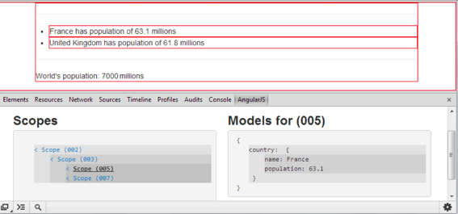
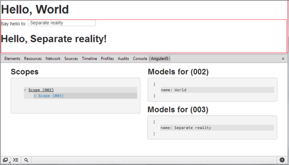
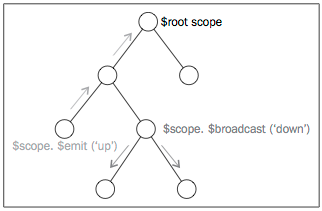
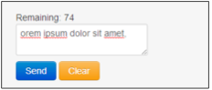

第一章
====

Angular 禅道
===
本章作为介绍AngularJS，框架和它背后的项目。首先，我们要采取一个简单的介绍一下项目本身的驱动，在哪里可以找到源代码和文档，如何寻求帮助，等等。
本章的大部分是充满介绍的AngularJS框架，它的核心概念，编码模式。有大量的材料覆盖，使学习的过程中快速，无痛，有大量的代码示例。
AngularJS是一个独特的框架，毫无疑问将塑造互联网几年来的发展空间。本章的最后一部分，这就是为什么解释什么使AngularJS如此特殊，它是如何比较其他现有框架，我们可以期待它在未来的。

在本章中，我们将涵盖以下主题：

* 如何写一个简单的Hello World应用程序AngularJS。在这样做的过程中，你会知道在哪里可以找到框架的源代码，它的文档和社区。
*  要熟悉基本构建块任何AngularJS应用程序模板与指令，范围和控制器。
*  要成为意识到的AngularJS复杂的依赖注入系统，其所有的细微差别。
*  要了解如何AngularJS的其他框架和库（尤其是jQuery的）比较，什么使得它如此特别。

遇到AngularJS
===
AngularJS是一个客户端JavaScript编写的MVC框架。在Web浏览器上运行，极大地帮助我们开发 现代，单页，AJAX风格的Web应用程序。它是一个通用的框架，特别是用来写CRUD（创建，读取，更新，删除）类型的Web应用程序。

熟悉的框架
===
AngularJS是最新的客户端的MVC框架，但它已经吸引了大量的关注，主要是由于其创新的模板系统，易于开发，非常扎实的工程实践。事实上，它的模板系统，在许多方面是独一无二的：

* 它使用HTML作为模板语言
* 不要求有一个明确的DOM刷新，AngularJS能够跟踪用户行为，浏览器事件和模型的变化，找出模板刷新
* 它有一个非常有趣的和可扩展的组件子系统，它是可以教的浏览器如何解释新的HTML标签和属性

模板子系统可能是最可见部分AngularJS的，但不要误会，AngularJS装备了几个实用程序和服务通常需要在单页面的Web应用程序是一个完整的框架。

AngularJS也有一些隐藏的宝藏，依赖注入（DI）和可测性的方面。内置的支持DI可以很容易地组装一个Web应用程序从较小的，彻底的测试服务。围绕它的设计框架和工具，促进测试实践在每一个阶段的发展过程。

在项目中寻找自己的方式
===
AngularJS的一个新角色就是它是一个相对较新的客户端的MVC框架场景;
在2012年6月发布的1.0版本。在现实中，这个框架的工作开始于2009年，谷歌员工MISKO Hevery的一个个人项目。最初的想法竟然是如此之好，在写作的时候，该项目正式通过谷歌公司的支持，并有全职工作的一个整体的团队在谷歌
工作于这个框架。

AngularJS它是由谷歌公司的一个开源项目托管在GitHub上（的角https://github.com// angular.js），并获麻省理工学院许可证的条款下。

在一天结束的时候，没有一个项目能在没有人支持下生存 . 幸运的是，AngularJS有很大的支持社区。以下是一些沟通渠道，其中一个可以讨论设计问题，并请求帮助：

* angular@googlegroups.com mailing list (Google group)
* Google + community at https://plus.google.com/u/0/
      communities/115368820700870330756
*  '#angularjs IRC channel
*  [angularjs] tag at http://stackoverflow.com


AngularJS团队在维护一个博客（http://blog.angularjs.org/），目前在社会化媒体，Google+（+ AngularJS的），推特（@ angularjs）。也有社区聚会在世界各地组织，如果发生托管附近一个地方，你的生活，它是绝对值得参加！


在线学习资源
===
AngularJS有自己的专用网站（http://www.angularjs.org），在这里我们可以找到一切人们所期望的框架：概念概述，教程，开发人员指南，API参考，等等。为所有发布AngularJS版本的源代码可以下载从http://code.angularjs.org。

人们寻找代码示例不会失望，因为的AngularJS文档本身有大量的代码片段。在此之上，我们可以浏览到内置在AngularJS（http://builtwith.angularjs.org）的应用程序集合。一个专门的YouTube频道（http://www.youtube.com/user/angularjs）有许多过往事件的录音，以及一些非常有用的视频教程。

库和扩展
===
是挤满了虽然AngularJS核心功能，活跃的社区，几乎每天都不断加入新的扩展。列出的许多人都在一个专门的网站：http://ngmodules.org。

工具
===
AngularJS是建立在HTML和JavaScript这两种技术之上，我们一直在web开发中使用多年。由于这一点，我们就可以继续使用没有任何问题，我们最喜欢的编辑器和集成开发环境，浏览器扩展，等等。此外，AngularJS社区贡献了一些有趣的补充到现有的HTML/ JavaScript的工具箱。

Batarang
===
Batarang是一个Chrome开发工具扩展插件,可以检查AngularJS的Web应用程序。 Batarang是非常方便的可视化和审查的AngularJS应用程序的运行时特征。我们看到这本书中广泛地使用它的来调试运行的应用程序。任何其他的Chrome扩展，可以安装Batarang从Chrome的的网上商店（AngularJS Batarang）中。

Plunker和jsfiddle
===
两个Plunker（http://plnkr.co）和的jsfiddle的（http://jsfiddle.net）使它很容易分享生动代码片段（JAVASCRIPT，CSS和HTML）。虽然这些工具都没有严格保留的用法与AngularJS，他们很快就被采纳由AngularJS社区分享小码的例子，情景重现bug，等等。 Plunker特别值得一提的，因为这是基于AngularJS开发的，并在社区中是一个非常流行的工具。

IDE扩展和插件
===
我们每个人都有一个喜欢的IDE或编辑。好消息是，一些现有的几个流行的IDE的插件/扩展，如Sublime Text 2（https://github.com/angular-ui/AngularJS-sublime-package），JetBrain的产品（http://plugins.jetbrains.com/plugin?pr=idea&pluginId=6971），依此类推。

AngularJS 速成
===
现在我们已经知道在哪里可以找到库的源代码和随行文档，我们可以真正编写代码并且看到AngularJS开发的效果。这部分内容中覆盖的AngularJS开发的模板，模块化和依赖注入的后续章节奠定了基础。这些都是任何AngularJS开发的 Web应用程序的基本构建块。

Hello World – the AngularJS example
===
让我们来看看典型的AnguarJS的“Hello World！”例子,开发中体验一下框架的第一印象`javascript`和语法实际效果。
	
	<html>
   		<head>
		
		</head>
		<body ng-app ng-init="name = 'World'"> <h1>Hello, {{name}}!</h1>
		</body>
	</html>
	


首先，我们需要包含的AngularJS开发的库，使我们的例子在Web浏览器中正确运行。这是很容易用AngularJS开发，在其最简单的形式中，被打包为一个单独的JavaScript文件。

---

	AngularJS开发库是一个相对较小的：一个缩小的gzip压缩的版本只有大约30 KB。 缩小的没有gzip压缩的版本大约80 KB。它不需要任何第三方依赖。
	在这本书中,对于小的例子，我们将使用一个未压缩，开发人员友好的版本，托管在Google的内容交付网络（CDN）。对于所有版本AngularJS的源代码都可以从http://code.angularjs.org处下载。

---

包含AngularJS库文件,不足以运行一个例子,我们需要bootstrap库,最简单的方式就是使用自定义的`ng-app` HTML 属性

检查<body>标签发现有个非标准的HTML属性:`ng-init	`. 我们可以使用`ng-init`在html模板渲染前去实例化(Model)模型.最后一位的`{{name}}`表达式,简单渲染(Model)模型的值

即使这个非常初级简单的例子,带来一些重要的AngularJS模板系统的特性,比如:

* 自定义HTML标记和属性,能给静态的HTML文档添加动态行为
*  双花括号`{{表达式}}`用于分割输出model(模型)的值

在AngularJS框架中,所有特定的HTML标记和属性都能理解和解析为directives(指令).

双向数据绑定
---
渲染模板引擎在AngularJS是很直接用于框架中,生成动态web应用程序.为了实际体验一下AngularJS的威力,我们扩展"Hello World"例子带有输入框,示例代码如下:

	<body ng-app ng-init="name = 'World'">
		Say hello to: <input type="text" ng-model="name"> 
		<h1>Hello, {{name}}!</h1>
	</body>

这里没有特别的关于`<input>` HTML标记部分,除了`ng-model`属性.实际的魔法发生在我们开始敲入文字到`<input>`文本框,突然每个按键后屏幕被重新绘制，以反映所提供的名称！没有需要编写任何代码，就会刷新一个模板，我们没有义务使用任何框架API调用来更新model(模型)。 AngularJS足够聪明，检测模型的变化，并相应地更新DOM。

大多数传统模板渲染系统呈现线性，单向的过程中：一个模型（变量）和模板结合在一起，产生一个结果标记。模型的任何变化，需要重新复算模板。 AngularJS是不同的，因为任何由用户触发view(视图)的更改会立即反映在model模型中，模型中的任何变化立即传播到一个模板。

AngularJS中的MVC模式
---
大多数现有web应用程序是基于一种非常出名的模型-视图-控制器(MVC)模式.但是问题是MVC并不是一个很精确的模式,
而是一个高层次,架构.更糟糕的是,有很多存在的基于原有模式的变化和衍生模式(MVP和MVVM似乎是最流行的).增加这种混乱,不同的框架和开发者尝试去解析提到的模式的不同.这样导致一个结果就是同样的MVC名字,会有不同的架构和编码体系.Martin Fowler在他的著名的GUI架构的文章中优雅的进行了总结.(http://martinfowler.com/eaaDev/ uiArchs.html):

   *Take Model-View-Controller as an example. It's often referred to as a pattern, but I don't find it terribly useful to think of it as a pattern because it contains quite a few different ideas. Different people reading about MVC in different places take different ideas from it and describe these as 'MVC'. If this doesn't cause enough confusion you then get the effect of misunderstandings of MVC that develop through a system of Chinese whispers.*
	
AngularJS团队采用了非常务实的做法,宣布他们的框架是基于MVW(模型-视图-任何)模式,基本上只要你能所感受到就去实践它 .

鸟瞰
---
所有的"Hello World"的例子,并没有采用任何明确的分层策略: 数据初始化,业务逻辑,视图都混合在一个文件中.
在实际的应用中,我们需要更加注重分层的实现.幸运的是AngularJS提供了布通架构结构,使我们能够正确的构建更复杂的应用

	所有本书随后的例子为了可读性都忽略了AngularJS的初始化代码(脚本包括,ng-app属性等)
	
让我们看一下直接的修改后的"Hello World"例子:

	

		Say hello to: <input type="text" ng-model="name"> 
		<h1>Hello, {{name}}!</h1>
	

`ng-init` 属性都去掉了,取而代之的是我们看到新的`ng-controller`指令和对应的JavaScript函数.这个`HelloCtrl`接受了神秘的`$scope`参数:
	
	var HelloCtrl = function ($scope) { $scope.name = 'World';
	}


Scope (作用域)
---
在AngularJS中`$scope`对象是暴露了领域模型给视图(模板).通过分配属性给作用域实例,我们能设置新的值给模板引擎去渲染.

作用域能增强数据和特定功能的视图.我们能暴露UI特定的逻辑给模板去定义函数在这个作用域实例上.
举例,可以给`name`变量创建一个get函数,如下代码:
	
	var HelloCtrl = function ($scope) {
      $scope.getName = function() {
         return $scope.name;
	   };
	}


而且当在模板上使用它的时候,代码如下:


	<h1>Hello, {{getName()}}!</h1>

	

`$scope`对象运行我们精确控制部分领域模型,并且能操作于视图层.概念地,AngularJS作用域是非常接近于MVVM模式.


Controller(控制器)
---
控制器主要的责任就是实例化作用域(scope)对象,实战中,实例化逻辑包含如下方面:

*  提供实例化模型的值
*  参数化`$scope`于UI相关的行为(函数)

控制器是规范化的JavaScript函数.它们既不必去扩展任何框架相关的类页不必去调任何AngularJS相关的API去实现他们的工作.

	请注意一个控制器其实做着与ng-init指令一样的工作,当它启动初始化模型值的时候.  
	控制器尽可能在JavaScript中去表达这个初始化逻辑,不需要HTML模板和编码
	
Model(模型)
---
AngularJS的模型是普通JavaScript对象.既不要继承框架基类,也不要用特殊方式去构建模型.

尽可能用已存在的纯JavaScript类和对象,用同样的方式运用在模型层.我们并不局限于模型属性所代表的原始值（可以使用任何有效的JavaScript对象或数组）。为了暴露一个模型AngularJS只需简单分配给`$scope`就可以了.

	AngularJS并不是侵入的,让我们保持模型对象不受特定框架代码的干扰.
	
作用域深化
---
每个$scope都是一个 Scope类的实例化.Scope类有方法去控制scope(作用域)的生命周期,提供基于事件传播机制,并且支持模板渲染进程

作用域的层次
---
让我们另外看一个简单的`HelloCtrl`例子:

	var HelloCtrl = function ($scope) {
		$scope.name = 'World';
	}


HelloCtrl 看起来类似于正规的JavaScript 构造函数,没有特殊的地方,除了`$scope` 参数.那这个参数是哪里来的呢?


新scope(作用域)创建于 `ng-controller` directive(指令) 通过`Scope.$new()`方法调用.等一会,这看起来我们需要至少一个实例 scope 去创建新 scope . AngularJS 有一个`$rootScope`(所有其他scope的父scope).当新应用程序启动后`$rootScope`实例就创建好了.


`ng-controller` 指令就是一个scope作用域创建的directive(指令).AngularJS将要创建一个新的Scope类的实例,每当遇到一个scope创建的指令在DOM树 .如果新创建的scope要指向他的父scope的化要用`$parent`属性.这样就会有多个scope创建的指令在DOM树上,并且结果是多个scope 要被创建.


	Scope(作用域)来自父子,树形结构的$rootScope实例.作用域的创建来自于DOM树,并不奇怪scope树会模仿DOM结构


现在我们知道有些指令会创建新的子作用域,你可能会疑惑为什么这么复杂.为了理解这个,让我们看一下例子,如何使用`ng-repeat` 重复指令.

Contrller 如下:

	var WorldCtrl = function ($scope) {
	$scope.population = 7000;
	$scope.countries = [
          {name: 'France', population: 63.1},
          {name: 'United Kingdom', population: 61.8},

    ];
    };

增加的标记片段看起来如下:

	<ul ng-controller="WorldCtrl">
		<li ng-repeat="country in countries">
			{{country.name}} has population of {{country.population}} 
		</li>
		

		World's population: {{population}} millions 
	</ul>

	
`ng-repeat`指令允许我们去迭代一个`country`的集合对象并且创建新的DOM元素,此元素的每一项都在集合对象里.
`ng-repeat`指令的语法将会容易上手.新变量 `country` 被创建为每个子项,暴露于`$scope`,通过视图去渲染.

但是这里有个问题,新变量需要暴露在`$scope`的每个`country`变量,并且布能简单覆盖暴露值.所以AngularJS为了解决这个问题,就为每个集合里的元素都建了一个新scope(作用域).新创建的scope会有个类似于DOM树的结构,并且我们会通过卓越的Batarang工具(Chrome插件)可以可视化显示出这个scope(作用域) :

我们在截屏上能看到,每个scope(作用域,标记为长方形),持有他自己的model的集合.尽可能定义相同变量在不同的scope不要创建名称冲突(不同的DOM元素将会指向不同的scope,并且相对应scope使用变量去渲染模板).
这种情况下,每个项有自己的名称空间,在前面的例子每个`<li>`元素都能得到他自己的scope,当`country`变量被定义的时候.

Scope(作用域)层级和继承
---

属性定义在一个scope(作用域)上会可视于它的所有子scope(作用域)，提供了子作用域不要重新定义相同名字的属性！这在实践中是非常有用的，因为我们并不需要一遍遍重新定义属性,这些属性本来就能通过作用域的层级关系所展示.

基于我们前面的例子,让我们假设我们要显示的是一个世界人口分布比例.要做到这一点,我们要定义一个worldsPercentage的函数,定义于WorldCtrl 控制器中,代码如下:

	$scope.worldsPercentage = function (countryPopulation) { 
		return 	(countryPopulation / $scope.population)*100;
	}
And then call this function from each scope instance created by the ng-repeat
directive as follows:

然后就可以通过每个作用域实例(`ng-repeat`指令创建)去调用这个函数
	

	<li ng-repeat="country in countries">
		{{country.name}} has population of {{country.population}}, 		{{worldsPercentage(country.population)}} % of the World's population

	</li>

AngularJS作用域的继承关系遵循相同的规则就是JavaScript的原型继承(prototypical inheritance),就是说当我们去读取属性(property)的时候,继承树的就会一直向上横贯生长,直到属性被找到.

通过继承的作用域(scope)层次的风险
---
通过作用域的层次能相当直观和容易理解当它涉及到的读访问.当它要写访问的时候事情就有点复杂了.
让我们看是如何发生的,假如我们定义一个变量在作用域(scope)上并且忽略它的子作用域.JavaScript代码如下:

	var HelloCtrl = function ($scope) {
	};
	
视图的代码如下:

	<body ng-app ng-init="name='World'"> <h1>Hello, {{name}}</h1>
	

		Say hello to: <input type="text" ng-model="name">
		<h2>Hello, {{name}}!</h2> 

	</body>

	
如果你运行这个代码,你会观察到name变量是可视化整个应用程序,即使它只是定义在最顶端的作用域(scope)!
这展示了变量的继承在作用域层次(scope hierarchy).换一种说法,变量定义在父作用域(parent scope)能被子作用域(child scopes)所访问.

现在让我们观察一下会发生什么事情当我们在<input>框上敲入文字,屏幕显示如下:

你可能会有点疑惑,这个新的变量是创建于`HelloCtrl` 控制器(controller)取而代之的是值的设置是在`$rootScope`实例.这种行为变得越来越奇怪,在我们意识到作用域(scope)的原型继承.所以说,所有应用JavaScript的对象继承原则,都适用于作用域的原型继承.作用域(scope)本来就是JavaScript对象而已.
有几个方式可以影响属性,从子作用域到父作用域.修改后的模板如下:

	<input type="text" ng-model="$parent.name">
	
虽然在这个例子上,可以直接用父作用域来引用解决,其实我们认识到这是一种很脆弱的解决方案.问题是`ng-model`指令使用的表达式`$parent.name`假定的是整个DOM结构.这足以在另外一个地方<input> 标记内插入另外的指令,足以使得$parent会指向完全不同的作用域.

	作为一个经验法则,尽量避免使用$parent属性,因为它强烈链接AngularJS表达式到DOM结构,在你的模板里.
	应用程序可能轻松突破简单改变的HTML结构.

另外一种解决方案是绑定属性到对象的属性而不是直接绑定到作用域(scope)的属性,修改后的代码如下:

	<body ng-app ng-init="thing = {name : 'World'}"> <h1>Hello, {{thing.name}}</h1>
	

		Say hello to: <input type="text" ng-model="thing.name">
		<h2>Hello, {{thing.name}}!</h2> 

	</body>	
	

这种方式是最好的,因为他不需要承担任何DOM树结构

	避免直接绑定范围的属性。双向数据绑定对象的属性（暴露在一个作用域）是首选的方式。
	作为一个经验法则，你应该有一个点表达提供ng-model指令（例如，ng-model=“thing.name）	 
	
作用域的层次和事件系统
---

作用域（scope）组织的层次类似于事件总线。AngularJS允许我们传播带有附件的命名事件通过作用域的层次（Hierarchy）。一个事件能被分发从任何作用域到上级（`$emit`），或者下级(`$broadcast`).





AngularJS的核心服务和指令都能用于这个事件总线去触发重要的应用程序状态的改变。
举个例子我们能收听到`$locationChangeSucess`事件（来自`$rootScope`实例的广播）被任何location(浏览器URL)的改变所捕获，得到下面代码：


	$scope.$on('$locationChangeSuccess', function(event, newUrl, oldUrl){ 

	//react on the location change here
	//for example, update breadcrumbs based on the newUrl

	});

`$on`方法存在于每个作用域（scope）实例能被调用注册到一个作用域事件处理器(scope-event handler)。
有函数能做为处理器（handler）的角色去被调用为一个已分发的`event`对象，并作为第一个参数。随后的参数将
对应于事件的有效载荷和事件类型的依赖。

相似的对于DOM事件，我们能调用`preventDefault()`和`stopPropagation()`方法 于`event`对象。`stopPropagation()`方法调用讲会阻止一个事件来自于作用域层级(scopes' hierarchy)的冒泡，只存在于事件向上分发在层级种（`emit`）。

	虽然AngularJS事件系统是建模后的DOM之一，这两个事件传播系统是完全独立的，并没有共同的部分。

虽然事件传播的范围层次是非常优雅的解决方案
（特别是当它涉及到全局，异步状态变化通知）的几个问题，应该谨慎使用。通常情况下，我们可以依赖于双向数据绑定，一个简洁的解决方案。在的整个AngularJS框架，有三个事件发出（`$includeContentRequested`，`$includeContentLoaded`，`$viewContentLoaded`），七个事件正在播出的（`$locationChangeStart`，`$locationChangeSuccess`，`$routeUpdate`，`$routeChangeStart$`，`$routeChangeSuccess`，`$routeChangeError`，`$destroy` ）。正如你可以看到，作用域事件非常谨慎，在发送自定义事件之前，
我们应该评估其他选项（主要是双向数据绑定）。

	在AngularJS中,不要尝试混合DOM 基于事件编程模型.绝大多数情况下会有更好的建设
	你的应用,而且你还能用双向数据绑定

作用域(scope)生命周期
---
作用域有必要提供独立的名称空间并且避免变量名冲突.作用域是个很小的有组织的层级帮助去管理内存使用.
当一个作用域不在使用的时候,它就会销毁.做为结果,模型和功能都暴露在此作用域上的将符合条件送入垃圾回收(GC)。

新作用域（scope）通常被作用域创建的指令所销毁或重生。尽可能手动创建和销毁作用域，如 `$new()` 和 `$destroy()`
方法。

视图（View）
---
我们见了足够的AngularJS模板的例子去了解到它不是另外一个模板语言，但是它是相当不同的野兽。
不仅仅此框架基于HTML模板语法并且允许去扩展HTML词汇，但是它是独特的能力去刷新部分屏幕，而不需要任何手工的接入！
在现实中，AngularJS HTML和DOM有更亲密的联系，因为它依赖于浏览器解析模板的文本（如浏览器会做任何其他的HTML文档）。浏览器中做标记的文本转化到DOM树后，AngularJS载入和遍历DOM结构解析。每次遇到一个指令，执行其逻辑AngularJS将指令转换成屏幕上的动态部分。
	
	由于AngularJS依赖浏览器去解析模板，我们需要确保的标记代表有效的HTML。
	要特别注意正确关闭HTML标签（没有这样做不会产生任何错误消息，但不会正确地呈现视图）。
	 AngularJS使用实时，有效的DOM树！

AngularJS使得它可以丰富HTML的词汇（我们可以添加新的属性或HTML元素，并教导浏览器如何解释它们）。
这几乎是类似于创建一个新的**领域特定语言（DSL）**在HTML顶部,
如何使指示浏览器去识别新指令。你经常可以听到，AngularJS“教浏览器新花样”。

声明式模板视图-命令式的控制器逻辑
---
AngularJS附带有很多方便的指令，我们将在下面的章节涵盖大部分现有的。可能是更重要的，
但是，这不是个别的指令的语法和功能，而是建造UI基础的AngularJS理念。

AngularJS推动声明的方法到UI建设。这在实践中意味着的是，模板都集中在描述了预期的效果，
而不是在实现它的方式。这一切听起来有点混乱，这样的例子可能会在这里派上用场。

让我们想象一下，我们被要求创建一个表单，用户可以在其中输入一个短消息，通过点击一个按钮，
然后将其发送。有一些额外的**用户体验（UX）**的要求，如邮件大小应限制在100个字符，如果超过此限制时，
应禁用“发送”按钮。用户应该知道还有多少字符数剩下。如果其余的字符数小于10，显示的号码应该改变显示风格
警告用户。它应该有可能提供消息的文本以及清除。完成形式类似于下面的截图：

前面的要求不是特别具有挑战性，并描述了一个相当标准的文本形式。尽管如此，还是有很多UI元素在这里协调，
因为我们需要确保正确的管理着按钮的禁用状态，其余的字符数是准确的，并用适当的风格显示，依此类推。
尝试先执行如下所示：

	

           

               <textarea ng-model="message">{{message}}</textarea>
           

           

             <button ng-click="send()">Send</button>
             <button ng-click="clear()">Clear</button>
           

	

让我们用前面的代码作为一个起点，建立在它之上。首先，我们需要显示其余的字符数，这是很容易的，
因为在下面的代码：

	Remaining: {{remaining()}}

`remaining()`函数定义的在`TextAreaWithLimitCtrl`控制器
上的作用域（scope），如下所示：	
	
	$scope.remaining = function () {
		return MAX_LEN - $scope.message.length;
	};

接下来，我们需要禁用“发送”按钮，如果消息不符合所需的长度的限制。这可以很容易地做，
从`ng-disabled`指令那获得一点帮助，如下代码：
	
	<button ng-disabled="!hasValidLength()"...>Send</button>
	
我们可以看到，在这里循环模式。我们只需要触摸来操作UI，
模板，描述了一个理想的结果（显示剩余的字符数，禁用按钮，等等）在模型的状态（在这种情况下，消息的大小）
的一小部分。这里最有趣的部分是，我们并不需要保持在JavaScript代码中的DOM元素的引用，
我们没有义务明确操纵DOM元素。相反，我们可以简单地专注于模型突变让AngularJS做繁重抬举。
所有我们需要做的是在指令的形式来提供一些提示。	

回到我们的例子，我们仍然需要确保当只剩下几个字符的时候，剩余的字符改变风格。这是一个很好的机会，
看到更多的例子使用声明式UI，在下面的代码：

	 
		Remaining: {{remaining()}}
	

这里`shortWarn()`函数是这样实现的：
	
	$scope.shouldWarn = function () {
		return $scope.remaining() < WARN_THRESHOLD; 
	};

CSS class的变化是由模型的突变驱动的，但没有明确的DOM操作逻辑在JavaScript代码中。UI被重绘基于一个声明表达“wish”。
我们说使用`ng-class`指令是这样的：“`text-warning`的CSS的class应该被添加到的``元素，每次用户应当告诫超出字符限制”。
这是说，“当一个新字符输入后的字符数超过了极限，我想找到一个``元素并且更改这个元素的`text-warning` CSS class”。

我们在这里讨论什么听起来像有一个微妙的差异，但实际上的声明式和命令式方法是截然相反的。
命令式的编程风格侧重于描述各个步骤导致期望取得的结果。
声明式的做法，焦点被转移到一个期望的结果。达到这个结果的步骤是支撑框架的支持与照顾。
这就像说“亲爱的AngularJS，这里我多么希望我的UI看当模型结束了一定的状态。
现在请去描绘出何时以及如何重绘UI”。

声明式的编程风格通常是更具表现力，因为它使开发人员提供非常精确的，低层次的指示。生成的代码往往是非常简洁，
易于阅读。但声明的方式工作，必须有机器可以正确解释更高级别的命令。我们程序开始依赖于这些机械的决定，
我们需要放弃一些低级别的控制。随着命令式做法，我们正处在全面控制和精细地调整每一个单一的操作。我们已经有了更多的控制权，
但必须付出的代价为“负责”是低层次，重复的代码被写入了很多。

熟悉SQL语言人会发现这一切似乎如此的熟悉（SQL是一个非常传神，声明式数据查询语言）。我们可以简单地描述预期的结果（数据获取）
和让（关系）数据库弄清楚如何去获取指定的数据。大部分的时间，这个流程运行的完美无缺，我们很快得到我们所要求。仍然存在情况下，
它是必要的以提供额外的提示（索引，查询规划提示等）数据检索过程控制权，或采取精细的性能调优。

AngularJS 模板中的Directives（指令）声明方式表达预期的效果，所以我们从这样提供一步一步的的指示如何改变DOM元素的各个属性
（通常的情况是在应用中基于jQuery）的工作方式中解放出来。
AngularJS很大程度上促进声明式的编程风格模板和命令式的JavaScript代码（控制器和业务逻辑）。有了AngularJS，
我们很少应用低层次的，命令式的指示来操纵DOM（唯一的例外是在指令中的代码）。

	作为一个经验法则，最好不要在AngularJS的控制器里面操纵DOM元素。
	在控制器里面获得DOM元素的引用，并且操作元素的属性表明是命令式的方式操作UI 
	- 这在AngularJS里面是不受推荐的方式构建UI。

AngularJS 指令（Directives）编写的声明式UI模板，让我们去快速描述复杂的，互动的用户界面（UI）。AngularJS将会采用一切低级的决定
何时以及如何操纵DOM树的部分。大部分的时间里AngularJS做“正确的事情”，比如 预期（及时）更新UI。
不过，重要的是要了解内部运作，使我们能够提供适当的提示给框架（假如它需要）。这里再次使用SQL来比喻，大部分的时间的我们并不需要担心
有关查询规划所做的工作。但是当我们开始撞到性能问题，你最好知道如何查询规划到达的决定的这样我们就可以提供额外的提示。这同样适用于
用户界面管理：我们需要了解底层的机制的有效地使用模板和指令。


模块和依赖注入（DI）
---
警惕读者可能已经注意到，目前为止所有的例子中都是使用全局构造函数来定义控制器。但是全局状态是邪恶的，
它伤害了应用程序的结构，使代码难以维护，测试和阅读。绝不是说AngularJS建议使用全局状态。相反，它配备了一组API，
使得它很容易定义模块和注册对象于这些模块中。

AngularJS中的模块
===
让我们看看如何调整丑陋，全局定义的控制器（controller）为模块方式，之前的控制器是这样定义的：

	var HelloCtrl = function ($scope) {
	    $scope.name = 'World';
	}

之后，我们用模块来描述：

	angular.module('hello', [])
	  .controller('HelloCtrl', function($scope){
      	 $scope.name = 'World';
     });

AngularJS本身定义了全局的名称空间`angular`。这个命名空间内有各种工具和方便性的函数，而且`module`就是其中之一的函数。
一个`module` 扮演这容器的角色，服务于其他AngularJS管理的对象（比如控制器，服务等）。
我们将很快看到，有更多关于模块的东西要学，而不仅仅是简单命名空间模块和代码组织。

要定义一个新模块我们需要提供模块功能的名字作为第一个参数。第二个参数使得它可以表达
依赖于其他模块（在前面的模块我们不依赖于任何其他模块）。

调用`angular.module`函数,会返回一个新创建的实例.一旦能得到这个实例,就可以开始定义新控制器(controller).这是最简单的调用`controller`函数,用如下的参数

* 控制器的名字(string)
* 控制器的构造函数

		全局定义的控制器的构造函数最好是用于快速代码的示例和快速原型.
		切勿使用全局定义控制器函数用在大型,现实生活中的应用程序.

模块定义之后,需要通知AngularJS告诉它的存在,通过给`ng-app`属性设置值来实现:

	<body ng-app="hello">
	
---

	
			忘记在ng-app属性里给模块设置名字是常见的错误和混乱的的共同来源,
			在ng-app属性里面省略模块名字会导致错误,会导致控制器未定义.
	
合作对象
---
我们知道AngularJS提供一种方式让我们在模块里管理和组织对象.模块不仅用于注册被框架直接调用的对象(控制器,过滤器,等等),而且通过应用开发者定义的任何对象

模块模式是相当有用于组织我们的代码,但是Angular更进一步.
除了登记在命名空间中的对象，但也可以以声明方式描述这些对象之间的依赖关系。

依赖注入(DI)
---
我们已经学会`$scope`对象被神秘地注入到控制器实例中.AngularJS具备某种能力去找出
一个新的,而且是控制器需要的作用域实例,然后创建一个新的作用域实例并将其注入.
控制器不得不做的唯一事情是要表达的事实，它依赖于`$scope`实例(不需要明确地指出如何新的`$scope`对象实例化,这个`$scope`实例被创建或者被调用是来自前面的一个重用).整个依赖管理归纳为事物是这样的:"我只知道正确的方式是我需要依赖(合作对象):我不知道它从哪里来或者也不知道它是如何被创建的.我值需要知道我需要它,请给我提供它".

AngularJS有个依赖注入引擎.它可以执行如下活动:

*  了解对象所表达的合作者的的需要
*  找到一个需要的合作者
*  打包对象们到全功能的应用中

能够以声明方式表达依赖的想法是一个非常强大,它释放对象而不必担心合作对象的生命周期。更妙的是，所有的突然,它有可能将交换合作者，然后创建不同的应用程序只需更换某些服务。对能够有效的单元测试组件来说,这也是一个关键因素。

依赖注入的优势
---
要看一个完整的使用依赖注入的系统,让我们考虑一个简单的通知服务的一个例子,我们可以推送消息并且后来可以检索消息.有些复杂的情况下，让我们说，我们希望有一个存档服务。应该通过以下方式与我们的通知服务合作，一旦通知的数量超过一定的阈值，最旧的通知应推到一个存档。额外的麻烦是，我们希望能够在不同的应用中使用不同的归档服务。有时倾倒旧消息到浏览器的控制台是最需要的，其他的时候,我们想使用XHR调用服务器发送过期通知。

通知服务代码如下:

	
	var NotificationsService = function () {
		this.MAX_LEN = 10;
		this.notificationsArchive = new NotificationsArchive(); 
		this.notifications = []; 
	};
	
	NotificationsService.prototype.push = function (notification) {
     
	var newLen, notificationToArchive;
    
     newLen = this.notifications.unshift(notification);
     if (newLen > this.MAX_LEN) {
       notificationToArchive = this.notifications.pop();
       this.notificationsArchive.archive(notificationToArchive);
		} 
	};
  
	NotificationsService.prototype.getCurrent = function () {
     return this.notifications;
	};

前面的代码紧密联系于归档的实现（`NotificationsArchive`）,即使这只是用了`new`关键字的部分实例化而已。不幸的是因为两个类都要依附于归档方法（接受通知消息服务被归档）。
具备交换协作者的能力对测试能力来讲是相当重要的。
这是很难想象隔离测试对象没有能力来代替真正的实现与假双打（模拟）。这章接下来的部分，我们将去实现如何重构紧密耦合的对象集，为灵活和可测试的服务集。为了实现这样一点
我们要利用好AngularJS的依赖注入子系统 。

注册服务
---

AngularJS仅仅具备包装它关注的对象。其结果是，第一步注入到依赖注入机制的只是注册一个对象给AngularJS模块（module）。我们没有直接注册对象实例本身，也不抛出创建对象的方法（秘诀）给AngularJS的依赖注入系统。AngularJS然后去解析这些方法给实例化对象，接着就相应的连接他们最终的效果就是一组实例化，形成一个正在运行的应用程序对象。

在AngularJS有一个专用的`$provide`服务，允许我们去注册用不同的方法去创建对象。
已经注册的方法接着就通过`injector`服务去解析，并提供，完全出炉，开箱即用的对象实例（带有所有的依赖解析和注入）。

通过`$injector`服务注册的对象被简称为服务。AngularJS会在应用程序生命周期内只解析一次，并且是只创建一个对象实例。（单例模式）

	$injecotr 创建的服务是单例的。每个运行应用程序实例种只有一个这样的服务实例。
	
归根结底，AngularJS模块只是持有一套对象实例，我们能控制这些创建的对象。

值（Values）
---
AngularJS 有个最简单的方法去管理预先实例化的对象：

	var myMod = angular.module('myMod', []); myMod.value('notificationsArchive', new NotificationsArchive());

所有AngularJS依赖注入（DI）机制管理的服务，都需要提供一个唯一的名字（在这个例子中，例如，`notificationsArchive`）。接下来是有创建新实例的方法。

值对象（Value object）是不是特别有趣，因为对象通过注册
方法可以不依赖于其他对象。这是没有太大的问题的对NotificationArchive实例来讲，因为它不具有任何相关性。在实践中，这种方法只适用于注册非常简单的对象（通常表示为内置对象的实例或对象文本）。

服务（Services）
---
我们不能注册`NotificationsService`服务为值对象，因为我们需要传达依赖于归档服务。最简单的注册这个一个对象的方式是，依赖其他对象，注册为构造函数。
我们能使用`service`方法如下：
	
	myMod.service('notificationsService', NotificationsService);
	
这里	`NotificationsService`的构造函数可以如下格式编写：

	var NotificationsService = function (notificationsArchive) { 
	
		this.notificationsArchive = notificationsArchive;
	
	};

通过使用AngularJS的依赖注入，可以在`NotificationsService` 构造函数上取消掉 `new` 关键字。
现在这个服务并不依赖于实例化，并且可以接受任何的归档服务。我们的简单应用程序现状更灵活了！

	一个服务是个超载，多用途的文字，可能带来很多不同的事情。在AngularJS中，文字描述的服务，针对的不仅仅是注册构造函数的方法（在前面的例子），也是基于AngularJS依赖注入，创建，管理的单例对象，任何使用过的注册的方法（这就是为什么大多数人都使用文字描述的服务，在angularJS的模块内容种采用）
	
在实践中，服务方法不常用的但可能会派上用场于手工注册的预先存在的构造函数，从而使管理由这些构造函数创建的对象。

工厂（Factories）
---
`factory`方法是另外一种注册对象的方式。它比`service`方法更灵活，因为它能注册任何随意的创建对象的函数。
举个例子：

	myMod.factory('notificationsService',function(notificationsArchive){
	
	 	var MAX_LEN = 10;
		var notifications = [];
	
	return {
		push:function (notification) {
           var notificationToArchive;
           var newLen = notifications.unshift(notification);
           //push method can rely on the closure scope now!
           if (newLen > MAX_LEN) {
             notificationToArchive = this.notifications.pop();
             notificationsArchive.archive(notificationToArchive);
           }
		},
         // other methods of the NotificationsService
       };


AngularJS会使用附带的`factory`函数去注册一个由返回值的对象。这可以是任何合法的JavaScript对象，
包括`function`对象！

factory 方法是最通用的方式，让给定的对象进入到AngularJS的依赖注入（DI）系统。它非常灵活而且能包含复杂的创建过程逻辑。因为工厂（factories）是正规函数，我们能利用这种优势：一个词汇性的作用域（scope）去模拟“`private`”变量。这会是非常有用的方式去隐藏给定服务的具体实现细节。确实，在前面的例子中，我们能保持`notificationToArchive`服务，所有的配置参数和内置状态(`notifications`)为“`private`”。

常量(Constants)
---

我们的`NotificationsService`正在变得越来越好，它解耦了它的合作者并且隐藏了自己的私有状态（private state）。
不幸的是，它仍然有硬编码的`MAX_LEN`常量。AngularJS可以补救，常量可以定义在模块级别，并且注入到任何其他合作对象内.
理想的做法是，我们将会让我们的`NotificationsService`具有被提供的配置值，用下面的方式：

	myMod.factory('notificationsService',
	
	function (notificationsArchive, MAX_LEN) { 
	  ...
     //creation logic doesn't change

     });

 然后提供配置值在NotificationsService的外部，在模块（module）级别去定义：

	myMode.constant('MAX_LEN', 10);
	
常量是非常有用的，当创建服务，当这个服务被用于多个不同的应用程序（
服务的客户可以根据自己的意愿去配置服务）。常量唯一的缺点就是，当一个服务表达出要依赖一个常量
的时候，常量的值必须提供。有时候这是个很好的默认配置值，允许客户在需要的时候，去改变它。

提供者（Providers）
---
到目前为止所描述的所有注册的方法是最通用的，只是特殊情况下。
超级版本的是：`provider`。这里有个例子是关于注册`notificationsService`服务通过提供者方式。

	myMod.provider('notificationsService', function () {
	var config = { 
		maxLen : 10
	};
	var notifications = [];
	

	return {
		setMaxLen : function(maxLen) {
           config.maxLen = maxLen || config.maxLen;
         },

         
		$get : function(notificationsArchive) { 
			return {
             push:function (notification) {
               ...
				if (newLen > config.maxLen) { 

				...
				}
			},
        // other methods go here
      	};
	   }
	 };
	});
	 
起初一个`provider`是一个必须返回包含`$get`属性对象的函数。提到的`$get`属性是一个工厂函数，当它调用时候，应当返回一个`service`实例。我们可以认为提供者就是作为对象，它包含工厂函数（factory function）在他们的`$get`属性 。

下一步，从一个`provider`函数返回的一个对象必须由附加的方法和属性。在用`$get(factory)`方法调用返回之前要尽可能的设置配置选项。的确，我们仍然能设置maxLen
配置属性，但我们不再有义务去做。此外，尽可能去得到更多的复杂配置逻辑，作为服务，能暴露出配置方法而且不仅仅是简单的配置值。

模块的生命周期
===

在前面的段落里，我们能看到AngularJS支持各种方式的对象创建。一个`provider`是个特殊方式，因为它提供了一种可能就是在产生任何对象实例之前，进行配置。为了更有效率的支持提供者（providers），AngularJS分离模块的生命周期为两阶段，如下：

*  配置阶段：搜集和配置所有的配方方法（recipes）。
*  运行阶段：执行实例化后的逻辑

配置阶段
---
提供者只能在配置阶段进行配置，确信，对象出炉后是不能改变配方方法？提供者能被配置为如下：

	myMod.config(function(notificationsServiceProvider{
		 notificationsServiceProvider.setMaxLen(5);
	});

	

最重要的事情要提醒一下：依赖于`notificationsServiceProvider`（带有Provider后缀）对象，呈现的配方方法是准备好了，可以执行的。配置阶段允许我们做最后时刻调整对象的创建公式


运行阶段
---
运行阶段让我们可以注册任何被执行的工作，在根据应用程序的引导期间。
有人认为运行阶段可以理解为其他编程语言的main方法。最大的区别在于AngularJS的模块具有多个配置和运行代码段。这种情况下，不是只有一个单一的入口（一个运行的应用程序真的在做合作对象的收集）。

去展示运行阶段是有用的，让我们想象一下，我们要显示应用程序的启动时间（或运行时间）给用户。为实现这个需求，我们可以设定应用程序的启动时间为$rootScope的一个属性。如下：

	angular.module('upTimeApp', []).run(function($rootScope) { 
		$rootScope.appStarted = new Date();
	});

然后可以在任何模板里获取运行时间。如下：

       Application started at: {{appStarted}}
       
 ---
 
         在示例中我们展示了我们的运行片段，是可以直接给$rootScope实例设置属性。
         最重要的是要意识到，这个$rootScope实例是全局变量，而且这是全局状态各种
         问题的来源。在$rootScope上定义的新属性只能保守地并且只是属性可以被
         各个模板所访问。
       
       
不同阶段和不同的注册方法
===
我们总结一下不同的创建对象的方法，如何这些方法对应于模块的生命周期：

 实体| F注册后得到的 | 在配置阶段可注入？ | 运行阶段可注入？ |
| ------------ | ------------- | ------------ |
常量（Constant）     | 常量值 | 可以  | 可以 |
变量 （Variable）    | 变量值 | -  | 可以 |
服务 （Service）   | 构造函数创建的新对象 | -  | 可以 |
工厂 （Factory）    | factory函数返回的新对象 |- | 可以 |
提供者 （Provider）   |$get工厂方法创建的新对象 | 可以 | - |

模块依赖于其他模块
---

 
 
       
     