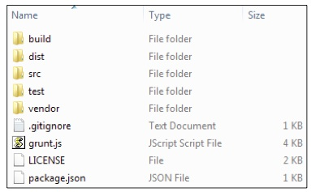
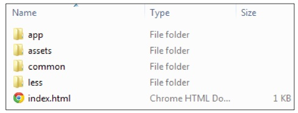
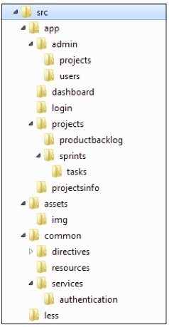
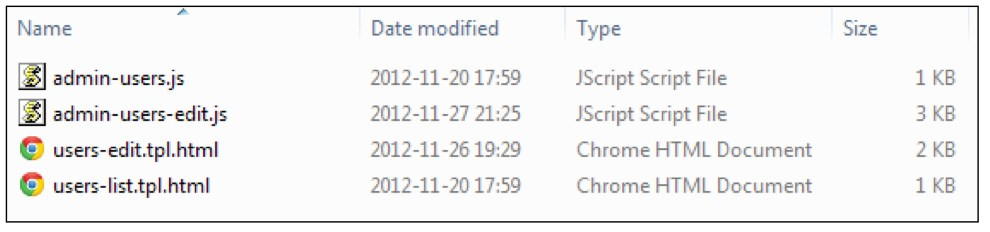

第二章
====
构建和测试
===


前一章我们介绍了AngularJS,覆盖的内容基本要素有,框架项目本身,背后的人,
基本使用场景.现在我们准备好去创建完整的,更复杂的WEB应用程序.本书的其余部分围绕着建造一个示例应用程序,它介绍了如何使用AngularJS在现实生活中的项目。

在下面的章节中，我们将构建一个简化的项目管理工具去支持Scrum敏捷软件开发方法。这个示例应用程序将帮助我们论证AngularJS API和习惯用法，以及覆盖典型的场景，诸如,和后端通信,组织导航,安全性,国际化,等等.本章要引入一个示例程序,它的问题的领域和使用的技术堆栈。

每个项目开始一些初步的决定文件组织策略，构建系统，雇用和基本工作流程。我们的示例应用程序是没有什么不同，我们本章将要讨论的构建系统和项目布局相关的专题.

自动化测试是坚实的工程实践是AngularJS和相关生态系统提升的.我们坚信自动化测试是强制的,对任何,但是最平常的项目.这就是为什么本章的最后部分要全力致力于测试:不同的类型,机制,工作流程,最佳实践和工具.

本章,我们将要学到:

*	本章使用的示例应用程序,它的问题领域和使用的技术堆栈.
*	为AngularJS web应用程序推荐的构建系统,以及相关工具和工作流程.
*	推荐的文件,目录,模块的组织.
*	自动化测试实践,不同类型的测试和他们在项目上的位置.
*	你会熟悉,测试用的通常用于AngularJS Web应用流程库和工具。

引入示例程序
===
这节我们会得到更多示例程序的细节,它将作为案例学习.

	    示例程序的源代码公开于git仓库,在GitHub中,
	    https://github.com/angular-app/angular-app.
	    该仓库包含完整的源代码,细致的安装指导和整个项目历史.
	   
	   
熟悉问题领域
---
为了展示AngularJS最有利的环境，我们要建立一个项目管理工具支持团队使用SCRUM方法.

		 AngularJS适用于使用框架去构建CRUD-相关的应用程序.
		 此应用程序包含很多的充满动态表单,列表,表格的屏幕.
		 

SCRUM是个流行的敏捷方法去运营项目,有希望的是很多读者都读过相关的内容.
对于的SCRUM新的内容,我们不必担心,因为SCRUM的基础很容易掌握.有许多优秀的书籍和文章，深入覆盖SCRUM,而是为了获得基本的理解它可能是足够了,过来介绍维基百科的文章的专题在<http://en.wikipedia.org/wiki/Scrum_(development)>

我们的示例应用程序的目的是协助团队管理SCRUM神器：项目和他们积压，冲刺和他们积压，任务，进度表，等等。该应用程序还具有一个功能齐全的管理模块来管理用户和项目工作。

	我们的示例应用程序不落下风的全面和严格遵守所有的Scrum原则。在必要的时候我们花几个快捷到清楚地说明AngularJS使用在建立一个真正Scrum项目管理工具的费用。
	
这个应用程序的,完成时,将会是如下的截屏:

	

看这个截屏,我们能立刻看到我们将要建造的是一个相当典型的CRUD方式的web应用程序:

*	获取,显示,编辑数据,来自持久层
*	身份认证和授权.
*	与所有支持的用户界面元素，如菜单，面包屑，相当复杂的导航架构。

技术堆栈
===
本书专注于AngularJS,但构建任何平凡web应用我们需要更多在浏览器中运行的JavaScript库.最低要求一个持久存储和后台服务架构.本书并不规定任何堆栈,我们确实认识到人脉使用AngularJS去连接不同的后端,服务端架构和持久存储.
尽管如此，我们不得不做出的选择来说明如何AngularJS融入一个更大的场景。

首先，我们选择尽可能使用JavaScript的友好技术.有很多优秀的后端平台和持久性存储在那里但我们想使我们例子为JavaScript开发者易于遵循跟进。此外，我们试图使用被视为JavaScript生态主流技术。
		  
		 在这本书中描述的协议栈和工具的所有元素是基于JavaScript的，
		 可以免费使用，开源项目。
		 
持久性存储
===
当涉及到数据存储有许多可供选择,最近NoSQL运动,只是一些替代中的一种。
对于这本书的目的我们要使用面向文档的MongoDB数据库,因为它非常适合进入面向JavaScript的环境：

*	文档存储为JSON方式的数据格式(二进制JSON- BSON).
*	查询和操作数据,用JavaScript和相似的JSON语法.
*	尽量导出REST端点的服务,并且处理数据用JSON格式.

本书的例子，不需要MongoDB的知识，我们会尽量解释棘手的地方，讨论的代码片段时候。
显而易见，我们建议MongoDB,或者面向文档nosql 数据库是更适合AngularJS应用程序。
AngularJS是后端与存储无关的。

MongoLab
---
MongoDB是相当容易起步的，大多数JavaScript开发者感觉在家一样，使用面向文档数据库。
为了更简便的处理示例程序，我们基于托管版本的MongDB。结果是无需安装软件，去运行本书的例子。

由多个基于云托管的MongoDB，我们发现MongoLab(<https://mongolab.com>)是可靠，易于启动，免费的数据库托管（数据库体积小与0.5GB）。MongoLab免费提供的存储空间，足够我们跑本书的示例了。
MongoLab 有一个或者多个不可忽视的优势；它提供REST服务的良好接口。我们讲会基于这个接口去展示AngularJS如何与REST端点通讯。

开始使用MongoLab，首先必要的是在线注册。这是个相当简单的过程，去填写短小的电子表格。
一旦注册完成。我们就可以享受接入托管的MongoDB数据库，通过JSON格式的REST接口，还有在线的管理控制台。

服务端环境
----
托管在MongoLab上的数据库，可以直接让AngularJS应用程序通过REST接口访问。对于非常小的项目，可以通过
浏览器直接访问MongoLab数据库；这不是很好的选择，对于其他实时，面向公众的应用程序。这是MongoLab提供的简单又不够安全的方式。

实际上，大多数AngularJS开发的UI都会和某些后台获取数据。中间件一般都会提供安全服务（认证）和验证权限（授权）。我们的示例应用并无不同，也需要一个后台。再一次，我们将押注于基于JavaScript的解决方案；node.js 。

node.js二进制版本适用于各种流行的操作系统。从<http://nodejs.org>下载二进制版本。你需要下载和安装node.js的运行环境到本机，才能运行本书的示例。

		介绍node.js已经超出本书的范围了。幸运的是node.js是非常简单的基础知识
		和它的包管理(node.js包管理-npm)是运行示例必须的。开发者熟悉了node.js后会
		发现很容易理解服务端后台的机制，虽然node.js的知识不是强制要求的。

除了node.js本身，我们讲要用node.js的库去构建示例应用的服务端组件。

*	Express（<http://expressjs.com/>）作为服务端web应用框架，它能提供路由，
	服务数据和静态资源。
*	Passport（<http://passportjs.org/>）作为node.js的安全中间件
*	Restler（<https://github.com/danwrong/restler>）作为node.js的HTTP客户端库。

当熟悉了node.js之后，提到的库，会非常有用，但并不是学AngularJS必须的。你可能想钻入node.js和列表上的库，假如你想获得更深入的理解服务端部分的示例。换句话说，你的工作涉及了使用不同的后端技术，你可以方向的忽略node.js的相关细节。

第三方JavaScript库
----
AngularJS可以独自使用去开发相当复杂的应用程序。在此同时，不需要重新发明轮子和重新实现流行的库。

示例程序尝试保持对外部库的独立依赖，第三方的库绝对是最小依赖了，然我们聚焦在AngularJS能做的。
很多项目，会使用著名的库 如 jQuery，underscore.js 等等。为了演示如何AngularJS可以共存与其他库兼容最新版本的jQuery到项目中。

Bootstrap CSS
---
AngularJS并不强制规定任何特定CSS的使用，以便任何人可以自由的设计应用的需要。
为了使我们的SCRUM应用看起来更时尚，我们使用流行的Twitter Bootstrap（<http://twitter.github.com/bootstrap/>） CSS。

示例应用包含了Bootstrap的 LESS模板，去描述如何LESS编译能包含在构建链上 。


构建系统
---

过去JavaScript被当做玩具语言使用。
近年来，JavaScript已经成为一种主流语言。每天正在编写和部署这些JavaScript开发的新的，庞大而复杂的应用。复杂度的增加意味着更多的代码要编写。
这些天，我们看的这些项目，包含成千上万的JavaScript代码。

不再推荐，在HTML文档上，只有一个JavaScript文件的情况。我需要构建系统。在部署到生成服务器之前，我们的JavaScript文件和CSS文件会遭受多次的检测，转换。
有些示例的转换包括：

*	JavaScript源代码必须检查是否符合编码标准，使用工具的工具比如jslint（<http://www.jslint.com>）,jshint(<http://www.jshint.com/>)或类似工具。
*	测试套件（Test suites）尽可能的经常执行，至少包含在每一次的构建的过程中。那样的测试工具和流程必须紧密集成在构建系统中。
*	有可能自动生成一些文件（比如示例中的CSS文件，从LESS模板中生成）。
*	文件可能被合并在一起，压缩后，优化浏览器的性能。

除了先前列出的步骤，在一个应用程序可以部署到生产服务器之前，通常有其他任务必须执行，如文件必须复制到最终目的地，文档更新，等等。在一个不平凡的项目，总是有许多艰苦的任务，我们应该尽量自动化。

构建系统的原则
===

开发人员喜欢编写代码，但在现实中，只有一小部分的时间，我们花在了一个文本编辑器前。相对于有趣的部分（设计，讨论，代码，bug修复），这儿有大量的疲于奔命的任务要经常执行。有时候非常多。构建一个应用程序，
是一个必须一遍遍执行的任务。所以最好是快速和不痛苦的。这里我们讨论一下管理我们的构建系统的原则。

自动化任何事
---

本书的作者，最不喜欢，人工执行，重复任务，一遍又一遍。我们很慢，犯错误，坦率的说，对这些苦差事容易感到厌烦。如果你像我们这样的，你会很容易地理解为什么我们坚信自动化构建过程中每一个可能的步骤。

计算机非常擅长重复性的工作；它不会执行错误的步骤，不需要咖啡时间，不被分心。我们的机器不会抱怨，我们
分担了大部分的任务给它们。投入到自动化每个可能步骤去构建系统的时间，都是马上有回报的，因为每天我们将会节省大量的时间。

快速失败，失败干净
---

典型的构建过程包括几个唯一的步骤。有些步骤会执行大多数的时间，一旦异常被发现，其他的步骤会失败。任务可能会在过程的早期，会失败，打断了构建过程。这保证了更多的耗时的步骤没有被执行。

我们艰难地学会了这些做事的规则是如此重要。初期，在`jshint`之前，示例应用服务的构建系统，被自动执行测试。我们经常发现我们都在等待所有的自动化测试案例去运行。经常发现构建过程被无效的JavaScript所打断。
解决方案是移动jshint任务到最开始的构建管道，尽可能的早发现。

最重要的是构建过程中断后要清理打印出来的异常消息。有了明确的错误消息，我们应该能够几秒钟内找出失败的根源。当我们做项目的时候，有没有比这更糟糕的事情呢，盯着神秘的错误信息，不知道如何解决。

不同的工作流，不同的命令
---

作为开发人员，我们都负责不同的任务。有一天，我们忙着添加新的代码（测试！），花费大量的时间集成新的功能之后。我们的构建系统应该反应这一现实，提供不同的命令，不同的工作流程。根据我们的经验，构建系统应该由3类构建任务：

1.	运行要快，断言代码要由正确性。在JavaScript项目中，这可能意味着运行`jslint/jshint`和执行
	单元测试。此命令应该是非常快，所以它可以执行得非常频繁。这个构建任务应该是非常由用的，开发代码使用测试驱动开发（TDD）方式。
2.	一个命令部署一个全功能的应用，用于测试目的：执行此生成任务后，我们应该能够在浏览器中运行的应用程序。为了做到这一点，我们需要做更多的处理，如生成CSS文件等。此任务是专注于构建一个UI相关的开发工作流程。
3.	生产部署构建任务应该运行在上一步中所有列出的核查以及编写一个应用程序的最终部署，如合并和缩小文件，执行集成测试，并依此类推。


构建脚本也是代码
---

构建脚本是项目的产出物的一部分。我们应该把它们与任何其他交付一样的爱护。构建脚本都必须可阅读，理解和维护 - 就像任何其他源代码。写的不好构建脚本地会显著减慢你的步骤，保证会有一些令人沮丧的调试会话。


工具
---
在上一节所述构建系统的设计原理，可以应用到任何项目，任何的工具集。我们选择的工具链是操作系统（OS）无关的，所以我们能运行示例应用程序或者流行的操作系统（OS）。

		  虽然我们已经选定了构建工具,在我们看来，示例项目最好的目的就是：
		  我们要明白,不同的项目使用不同的工具。其余的这本书和建议从这一章
		  应该仍然是相关的和容易适应不同的构建系统。
		  
Grunt.js
---
示例SCRUM应用程序的构建系统，装备了Grunt(<http://gruntjs.com>). `grunt.js`广告词：

		JavaScript项目，基于任务的命令行工具
		
对我们来说最重要的是`grunt.js`构建脚本是用JavaScript开发的，执行在`node.js` 平台。这是非常好的消息,这意味着我们可以使用相同的平台和相同的编程语言对于构建和运行示例应用程序。

Grunt属于面向任务构建工具的相同目录，如Gradle （Groovy开发的脚本）或者Rake（Ruby开发的脚本），		所以人们熟悉这些工具应该有家的感觉。

测试库和工具集
===

AngularJS使用，促进和鼓励自动化测试实践。AngularJS团队需要非常认真对待可测试性,他们确保他们编写的代码使用AngularJS容易测试。但整个可测试性在这里不停,AngularJS团队编写或扩展的工具以使测试容易在实践中。

Jasmine
---
Jasmine (<http://pivotal. github.com/jasmine/>). Jasmine是个测试JavaScript代码的框架，
它来源于行为驱动开发（BDD），并且影响了它的语法。

所有的例子在原始AngularJS文档使用的是Jasmine的语法,因此这个测试框架是一个自然的选择对我们的示例应用程序。此外,AngularJS写各种模拟对象和Jasmine的扩展提供了一个很好地集成,实用的日常测试经验。

Karma runner（运行器）
---
Karma runner (<http://karma-runner.github.io>) ，更易于执行JavaScript测试。Karma runner注定要取代其他流行的测试运行器（test runner）JS TestDriver带有稳定，纯JavaScript，node.js的解决方案。

Karma runner可以调度源和测试代码的运行一个浏览器实例(或开始一个新的如果需要!),触发执行的测试,测试结果和报告收集个人的最终结果。它使用真正的浏览器来执行测试。这是一个大的突破在JavaScript的世界,因为我们可以同时在几个浏览器执行测试,确保我们的代码将在野外操作正确。
	
			Karma runner是一个了不起的工具，基于它的稳定性和速度。
			它是用于AngularJS项目执行测试部分的持续集成构建。
			在每一个构建Karma runner 执行大约2000单元测试在多个浏览器上。
			总计14000测试被执行在大约20秒内。这些数字应该提高我们的信心：
			Karma runner作为一种工具,AngularJS作为一个框架。
			
测试是一个中心主题在AngularJS,我们要进一步深入查看Jasmine测试和Karma runner在本章后面。

组织文件和目录
===

到目前为止我们已经取得了一些非常重要的决策技术堆栈和使用到的工具,而构建示例应用程序,SCRUM现在,我们需要回答一个至关重要的问题,如何组织不同的文件在有意义的文件夹结构。

任何给定的项目有多种方式组织文件。有时我们做的选择,是因为一些现有的工具和框架强制规定的布局。但无论是`grunt.js`还是`AngularJS`都没有强加任何特定的目录结构,所以我们可以自由做出自己的选择。在接下来的段落,你可以找到一个提议，组织文件和依据后面这个提议。你可以选择使用前面描述的结构,在你未来的项目或调整它以适合您的特定需要。
		
		
根目录
---
在设计文件夹布局我们想最后一个目录结构,使它容易导航代码库中。同时我们需要保持在一个合理的水平建立复杂性。

这里有一些基本的假设引导我们的高级的目录结构:	

*	应用程序的源代码和相关测试应明确分开。这是保持构建系统易于维护,因为通常有不同的构建任务执行测试和源代码。
*	第三方代码的任何外部库应该清楚地隔离于我们内部的代码库。相对于我们的交付物，外部库应该不同的地方改变。我们想在任何时候都能容易的升级外部依赖。我们的源代码与外部库的混合会使得升级很困难和费时。
*	与构建相关的脚本应该驻留在自己的专用文件夹和不会散落在代码库。
*	构建结果应该输出到一个单独的文件夹。的内容和结构构建输出应密切匹配一个强制要求的生产部署需求。它应该很容易就抓住输出的构建和部署在其最终的目的地。

采取上述所有假设考虑，我们最终采用以下顶级目录项目:

*	src:包含应用的源代码
*	test:包含伴随的自动化测试
*	vendor: 第三方依赖库
*	build: 构建脚本
*	dist: 构建结果，准备部署到目标环境

最后，这样就是一个顶级目录结构的可视化：



除了上述文件夹我们可以注意到一些高级文件。这些文件仅供参考:

*	.gitignore: git SCM相关，包括规则指明哪个文件不应该被跟踪在一个git仓库。
*	LICENSE: 包括的MIT许可证。
*	Gruntfile.js: grunt.js文件的入口点。
*	packeage.json: node.js应用的包描述。

源代码的内部
----
基本的目录结果，深入到src目录。我们来看看：



`index.html `文件是应用程序的入口。这里有4个目录，2个是包含AngularJS相关的代码（`app`和`common`）和2个其他的包含AngularJS无关的表现层产出物(`assets`和`less`)。

这个`assets`和`less`目录，很好理解；首先`assets`包含图片和图标，第二个是LESS变量。请注意，Twitter的Bootstrap的CSS的LESS 模板，在`vendor`目录，这里只是放置变量的值。

AngularJS相关文件
---
AngularJS应用程序包含两类文件类型，有名字的脚本和HTML模板。所有重要项目将产生许多不同类型的文件,我们需要找到一种方法来组织这些大量的文件。理想情况下我们想让相关文件一起,让无关的远离。麻烦的是,文件可以有许多不同的方式联系在一起,我们已经有了只有一个目录树来表达这些关系。
常见的策略解决这个问题涉及文件的功能分组(包的功能),通过一个架构层(包被层),或者通过一个文件类型。我们想提出这是一个混合的方法:

*	大部分的应用程序文件应该是按照特性来组织。脚本和相关物,在功能上互相关联应该放在一起。
	这样的安排是非常方便的，同时致力于应用程序的垂直切片，从所有的文件一起改变，被组合在一起。
*	文件封装横切关注点(持久性存储访问,本地化,常见的指令等)应该被组合在一起。这里的依据是，基础
	设施相关的脚本，依附于功能代码，改变的速度不一致。在一个典型的应用程序生命周期，一些技术基础设施是写在早期，被关注的焦点转移到功能代码，作为应用程序的成熟度。文件在通用、基础设施水平区域是最好是组织在架构层。
	
我们可以直接转换上面的建议,下面的示例应用程序的目录结构:



	目录结构描述的，在这里不同于推荐方式的AngularJS seed 的项目(<http://github.com/angular/angular-seed>). angular-seed项目对简单的工程项目，比较适用，但是社区的共识，是大的工程项目，最好是按照专题来组织目录。
	
	
开始简单
---
看到这样的目录结构,我们注意到这样深入的目录结构包括了功能代码.这些文件夹中密切配合分层导航中的应用程序本身
这是可取的,因为应用程序的UI我们可以快速了解相应的代码可能被存储。

最好的主意,就是开始一个简单结构的的项目工程,并采取小步骤开始直到最终的目录布局.例如:示例应用的管理模块并不包含子目录在开始的时候,管理SCRUM项目包含的所有功能,用户在一个目录中。代码库演变和文件越来越大(多)新添加子文件夹。文件夹结构可以在多个迭代重构和演化,类似源代码的演化。


控制器和局部模板的同步进化
===

通常的项目中,根据文件类型组织目录文件夹.AngularJS中,JavaScript文件和模板文件,通常是分开在不同的目录结构.这种分离听起来像是一个好主意,但在实践中模板和相应的控制器往往以同样的步伐发展。这就是为什么在SCRUM示例应用程序模板和控制器保持在一起。每个功能区将拥有自己的文件夹和两个模板和控制器将驻留在一个文件夹中。




测试目录内部
===
编写自动化测试运行维护应用程序是否正常,测试代码是密切相关的功能代码.
并不惊奇,`test`目录结构与`src/app` 类似:


很简单就看的出来,test目录包含的内容与源代码的根目录包含的类似.
所有的测试库文件都在vendor目录,Karma runner的测试配置在他自己的home (config).


文件名转换
===
重要的是要建立一些文件命名约定使得代码的导航更容易些.这里有一组约定,往往在AngularJS社区和本书中采用.

*	所有的JavaScript文件都以.js为后缀名.
*	局部模板最好是.tpl.html后缀 .这样我们能轻易的从其他HTML文件区分出来.
*	测试文件名称与被测试的文件相同和后缀依赖于测试类型。单元测试应当用.spec.js后缀.

AngularJS模块和文件
===


现在我们的应用程序很好地组织到文件夹和文件我们可以开始考虑单个文件的内容。这里我们将关注JavaScript文件,其内容和关系AngularJS模块。

一个文件,一个模块
===

在*第一章,AngularJS禅道 *我们看到,AngularJS模块可以相互依赖。AngularJS应用程序中这意味着我们需要处理两个目录层次结构和模块的层次结构。现在,我们要挖掘更多的到这些主题为了想出务实的建议组织AngularJS模块和内容。


基本上有三种方法我们可以与单个文件和AngularJS模块相关联:

*	允许多个AngularJs模块在一个JavaScript文件
*	让AngularJS模块跨域多个JavaScript文件吗?
*	每一个JavaScript文件确切定义一个AngularJS模块.

在一个文件中定义多个模块不是非常有害,但这可能导致大文件数百行代码。除此之外很难找到一个特定的模块代码库,我们需要找到这两个文件在文件系统中,和一个模块内的文件。虽然有多个模块在一个文件可能非常适合简单的项目的工作,但不适合大型代码库。

有一个模块可能跨越多个文件是应该避免的。一旦一个模块的代码分布在多个文件我们需要开始考虑文件的加载顺序:模块声明之前需要提供者注册。此外,这些模块往往是更大的,这样更难维护。大模块单元测试可能特别不受欢迎的,我们想要负载和实践单位的代码实际上尽可能的小。

三个建议中,一个AngularJS模块一个文件似乎是最明智的方法。

	坚持一个文件等于一个AngularJS模块原则。
	这将允许您保持相对较小,主要文件和模块。
	另外你不会关心这些文件的加载顺序。
	还可以在单元测试下,尽可能加载个体的模块。
	
	
模块内部
===

声明一个模块就可以用来作为创建对象的注册方式.作为一个提醒,这些方式被称为提供者(provider)在AngularJS术语.每个提供者执行时,会产生一个运行时服务实例。服务创建的方式有多种表达(工厂,服务,提供者和变量)的净效应总是相同的;一个已配置服务实例。


注册提供者的不同语法
===

注册一个新的提供者(provider) 需要手把手的先知道模块的实例.这当然是简单的.模块实例通常都是调用了`angular.module` 方法 得到的.	

我们可以保存引用返回的模块实例和重用它注册多个提供者。例如,注册两个控制器在模块中负责管理项目,我们可以写:

```JavaScript

	var adminProjects = angular.module('admin-projects', []);
	
	adminProjects.controller('ProjectsListCtrl', function($scope){ 

	//controller's code go here
	});

	adminProjects.controller('ProjectsEditCtrl', function($scope) { 

	//controller's code go here
	});
```


虽然这种方法当然是一个缺点;我们必须声明一个中间变量(在这种情况下`adminProjects`)就可以声明多个providers在一个模块。
更糟的是,全局名称空间中的中间变量可能结束,如果我们不采取额外的预防措施(包装模块声明为一个闭包,创建一个名称空间,等等。)。理想情况下,我们希望能够以某种方式检索一个已经声明模块的一个实例。事实证明,我们可以在下一个示例中所示:


```JavaScript

	angular.module('admin-projects', []);

	angular.module('admin-projects').controller('ProjectsListCtrl',
	function($scope) {
     	//controller's code goes here
   	});

	angular.module('admin-projects').controller('ProjectsEditCtrl',
	function($scope) {
     //controller's code goes here
   	});
```

我们设法消除额外变量,但没有得到任何更好的代码。你能注意angular.module(“admin-projects”)是到处重复,这是邪恶的,有一天如果我们决定重命名一个模块,这能重创我们.
在此之上的语法来声明一个新的模块和检索现有一个,这能很容易错误引导,非常混乱的结果。
只是比较`angular.module('myModule')`和`angular.modlue('myModule',[])`
就很容易忽视区别,对不对?

	最好避免使用`angular.module('myModule')`构造器,来获取AngularJS模块.
	语法是冗长的,导致代码重复。更糟的是,模块的声明很容易困惑在访问现有模块的实例。
	
幸运的是还有一个方法可以解决所有的问题描述。让我们先来看看代码:

```JavaScript

	angular.module('admin-projects', [])
    

     .controller('ProjectsListCtrl', function($scope) {
       //controller's code go here
	})
    

     .controller('ProjectsEditCtrl', function($scope) {
       //controller's code go here
	});


```	
	
我们可以看到,尽可能链接调用控制器的注册逻辑.每一次调用`controller`方法,就会返回一个模块的实例,他的方法被调用.其他提供注册的方法(factory,service,value等等)都是返回一个模块的实例,也因此可以注册不同的提供者使用相同的模式。


在我们的例子SCRUM应用程序,我们将使用链式语法去描述注册所有的提供者.这种注册提供者的方式,消除了创建多余(潜在的全局)变量,避免了代码重复.提供了可读性,努力使得代码是格式化.

声明配置,运行片段的语法
===

*第一章:AngularJS禅道*描述的启动AngularJS应用的过程,分为2个阶段,`configure`阶段和`run`阶段(配置阶段,运行阶段).每个模块可以有多个配置和运行。我们不局限于一个。

原来AngularJS支持两种不同的方式去注册函数,应该执行在配置阶段。我们已经看到,可以指定一个配置函数作为第三个参数在`angular.module`函数:


```JavaScript
	
	angular.module('admin-projects', [], function() { 
		//configuration logic goes here
	});


```


前面的方法允许我们注册一个且只有一个配置块。这个模块的声明很详细(特别是,如果一个模块指定依赖于其他模块)。一个可选的形式是`angular.config`方法。

```JavaScript
	
	angular.module('admin-projects', []) 
		.config(function() {
       		//configuration block 1
     	})
	

		.config(function() { 
			//configuration block 2
		});

```


正如您可以看到的,另一种方法可以注册几个配置块。这可能会方便分裂大配置函数(特别是有多个依赖项)成更小的、集中的函数。小,内聚函数更容易阅读、维护和测试。

在SCRUM示例应用程序,我们将使用后面的注册形式配置和运行函数，我们发现它更具可读性。

	下载示例代码
	你能下载你在网站<http://packtpub.com>买过的所有的Packt公司出版的图书示例代码文件。如果你在其他地方买的这本书，你能访问<http://packtpub.com/support> 并且注册后，会直接邮件给你。
	
	
自动化测试
===


软件开发是困难的。作为开发人员,我们需要兼顾客户需求和最后期限的压力,有效地与其他团队成员工作,而与此同时精通多种软件开发工具和编程语言。随着软件复杂度的上升也是bug的数量也上升。我们都是人类,我们会犯错误,大量的错误。低级,编程错误只是一种类型的缺陷,我们需要不断地与之战斗。安装、配置和集成问题也困扰着任何有价值的项目。

因为，很容易引入不同类型的错误在一个项目,我们需要有效的工具和技术来对抗那些错误。软件开发行业的整体意识到越来越多的,只有严格应用自动化测试可以保证质量,按时交付。

自动化测试最早在敏捷开发方法论里面流行起来（极限编程，XP）。但是几年前这些都是新的和革命性的（一定程度上是有争议的），现在是被广泛接受，标准实践。现在，没理由不去全面理解自动化测试。

单元测试是我们的第一防线对抗编程bug。这些测试顾名思义是专注于小单位代码,通常单个类或集群密切合作的对象。单元测试是开发人员的工具。他们帮助我们断言,我们得到了低层结构正确,和我们的函数产生预期的结果。但是单元测试，带来更多的好处，通过超越简单，一次性代码验证：

*	他们帮助我们在开发过程的早期找到问题，早期的调试和修复是低成本的。
*	编写良好的测试集可以被执行在每一次的构建，提供非回归测试套件，这给了我们心灵的安宁,让我们引入代码更改以极大的信心。
*	可以说没有比一个编辑器和一个测试运行器，更好、更轻量级开发环境。我们可以迅速行动，在没有构建,部署并点击应用程序来验证我们的改变是正确的。
*	写代码测试优先使用测试驱动开发(TDD)方法帮助我们设计类及其接口。测试作为另一个客户端调用我们的代码,这样帮助我们设计灵活、松耦合的类和接口。
*	最后但并非最不重要的是,现有的测试可以作为文档。我们总是可以打开一个测试,看看一个给定的方法应该调用,什么是一组接受参数。更重要的是,这个文档是可执行的,总是最新的。
	


单元测试有很大帮助,但他们不可能抓住所有可能的问题。在某些配置和集成方面，单元测试并不能发现问题。彻底覆盖我们的自动化测试的应用程序需要执行更高级的、端到端(集成)测试。集成测试的目标是操练一个组装应用程序并确保所有单独的单位很好地在一起,形成一个全功能的应用程序。

编写和维护自动化测试是一种技能,像其他技能需要学习和磨练。在测试之旅的开始你可能会觉得测试实践会让你放慢脚步和不值得的。但是随着您越来越精通测试技术,你会感激我们获得多少时间，通过严格测试代码。


	有一个引用说写代码没有版本控制系统(VCS)就像没有降落伞跳伞。
	今天人们几乎不可能考虑运行一个项目不使用VCS。
	同样适用于自动化测试,我们可能会说:“没有自动化测试套件的
	编写软件就像爬山不带绳子，跳伞不用降落伞一样”。
	你可以尝试,但结果几乎肯定将是灾难性的。


AngularJS团队充分认识到自动化测试的重要性,严格适用于测试实践工作的框架。什么是神奇的,是AngularJS附带了一组工具,库和建议,使我们的应用程序容易测试。


单元测试
===


AngularJS采用Jasmine作为测试框架：单元测试框架本身也是用Jasmine写的，所有的文档中的例子都是使用Jasmine语法编写。此外AngularJS还扩展了原始Jasmine很少有用的插件库,使测试更容易。

Jasmine测试解剖
===

Jasmine号称它是“行为驱动开发的JavaScript测试代码的框架"。行为驱动测试本意是测试规范库的语法，读起来像英语句子。让我们通过标准的JavaScript类去描述如何工作的：

```JavaScript

	describe('hello World test', function () {
	
	var greeter; 

	beforeEach(function () {
       greeter = new Greeter();
     });

     
	it('should say hello to the World', function () {
		expect(greeter.say('World')).toEqual('Hello, World!');
	}); 

	});

```
有几个构造在上面的测试,需要一个词的解释:

*	`describe`函数，描述应用程序的专题功能。它作为一个聚合容器为个人测试。
	如果您熟悉其他测试框架，你可能认为`describe`块是作为测试套件。
	`describe`块可以嵌套在对方。
*	测试本身必须包含在`it`函数中，这个想法是为了一个测试的一个特定方面的特性。
	让测试有一个名称和一个主体。通常测试的第一部分的主体测试调用一个对象的方法,
	而第二个验证预期结果。
*	`beforeEach`中包含代码块会在每个测试之前执行。他是一个完美的地方,任何初始化逻辑,在每个测试之前执行。
*	最后的事情就是提到`expect`和`toEqual`函数。使用这两个构造我们可以比较实际的结果和期望的值。
	Jasmine，和其他许多流行的测试框架一样，提供了一组丰富的匹配器，`toBeTruthy`,`toBeDefined`,`toContain` 只是几个例子。
	

测试AngularJS对象
===
测试AngularJS对象，与其他测试正规的JavaScript对象没有大的区别。AngularJS有依赖注入系统和集成在单元测试内的方式。学习如何编写测试DI的机制，我们要关注测试服务和测试控制器。


	所有测试相关的扩展和模拟对象都分布在独立的AngularJS文件，叫angular-mocks.js。
	不要忘了包含这个脚本到你的测试运行器中。同时,重要的是，不要让这个脚本包含在已部署的应用程序的版本中。
		
测试服务
===
编写测试对象在AngularJS模块注册很简单但是需要初始设置。更具体地说,我们需要确保一个适当的AngularJS模块初始化和整个依赖注入（DI）机制贯穿其中。幸运的是AngularJS提供了一组方法,使茉莉花的测试和依赖注入系统都非常好地一起玩。

让我们打断一下这个简单的测试 ， notificationArchive 在*第一章 AngularJS禅道*介绍的。看看，如何测试AngularJS 服务。提醒一下，服务的代码本身：

```JavaScript

	angular.module('archive', []) 
		.factory('notificationsArchive', function () {
	    
	       var archivedNotifications = [];
	       return {
	         archive:function (notification) {
	           archivedNotifications.push(notification);
	         },
	         getArchived:function () {
	           return archivedNotifications;
	         }};
		});

```

对应的测试：

```JavaScript

	describe('notifications archive tests', function () {

	    var notificationsArchive;
		beforeEach(module('archive'));

		beforeEach(inject(function (_notificationsArchive_) { 
			notificationsArchive = _notificationsArchive_;
		}));
	  	
	  	it('should give access to the archived items', function () {
	       var notification = {msg: 'Old message.'};
	       notificationsArchive.archive(notification);

	       expect(notificationsArchive.getArchived())
	         .toContain(notification);
		}); 
	});


```

此时你应该能够识别熟悉的Jasmine的结构测试和发现一些新的函数调用:`module`和`inject`。

Jasmine中使用的`module`函数测试表明,服务从一个给定的模块应该准备测试。这种方法的作用类似于一个`ng-app`指令。它表示,应该创建AngularJS `$injector` 创建于对于一个给定的模块(和所有依赖的模块)。

	不要混淆在测试中使用的module函数与angular.module 方法。
	虽然两者的名字一样，但是他们的角色相当不同。
	angular.module是用于声明新的模块，
	而module函数是允许我们去指定模块用于这个测试。
	
在现实中可以有多个`module`函数调用在一个测试中。在这种情况下，来自特定模块的所有服务，值，和常量都存在于`$injector`


`inject` 函数有个简单的责任，就是注入服务到我们的测试。

最后部分，可能有迷惑，就是神秘的下划线在inject函数调用中：

```JavaScript

	var notificationsArchive;

	beforeEach(inject(function (_notificationsArchive_) {
	
		notificationsArchive = _notificationsArchive_; 

	}));


```
	
正在发生的事情是$injector会剥离任何一对前导和尾部的下划线，当侦测函数的参数去获取依赖。
这是一个有用的技巧，因为我们可以节省变量名，不用下划线标准测试本身。


测试控制器
===


测试控制器遵循类似测试服务的模式。让我们看一下片段`ProjectsEditCtrl`控制器的示例应用程序。该控制器是负责编辑项目管理应用程序的一部分。在这里我们将控制器的测试方法负责添加和删除项目的团队成员:

```JavaScript

	angular.module('admin-projects', [])
     .controller('ProjectsEditCtrl', function($scope, project) {
       
        $scope.project = project;

		$scope.removeTeamMember = function(teamMember) {
		   var idx = $scope.project.teamMembers.indexOf(teamMember); 
		   if(idx >= 0) {
           $scope.project.teamMembers.splice(idx, 1);
         }
		};
      
       //other methods of the controller
    
    });

```


提供的控制器的逻辑不是很复杂，让我们聚焦在测试本身。
```JavaScript


	 describe('ProjectsEditCtrl tests', function () {

	     var $scope;
	     beforeEach(module('admin-projects'));
	     beforeEach(inject(function ($rootScope) {
	       $scope = $rootScope.$new();
		}));

		it('should remove an existing team member', inject(function
	   ($controller) {

	       var teamMember = {};
	       $controller('ProjectsEditCtrl', {
	         $scope: $scope,
	         project: {
	           teamMembers: [teamMember]
	         }
			});
	       //verify the initial setup
	       expect($scope.project.teamMembers).toEqual([teamMember]);

	       //execute and verify results
	       $scope.removeTeamMember(teamMember);
	       expect($scope.project.teamMembers).toEqual([]);
		}));
	 });

```

`removeTeamMember`方法我们要测试的,将会定义在$scope,而且是在ProjectsEditCtrl控制器里定义该方法. 为了更有效率的测试removeTeamMember方法,我们需要创建新的作用域(scope),一个新的ProjectsEditCtrl控制器的实例,链接在一起.本质上我们需要手动做的ng-controller指令的工作。

让我们把注意力转到beforeEach 一会,因为这里有 有趣的事情.首先,我们访问$rootScope服务和创建一个新的$scope实例($scope.$new()).我们确实在模拟
