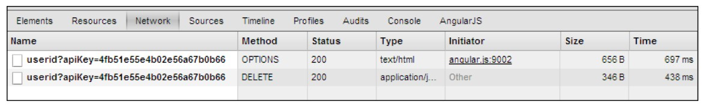

#第三章： 与后端服务器通讯


---
web应用程序通常需要与获取和操作数据的持久存储。特别是crud类应用程序数据编辑是至关重要的部分。

AngularJS最适合与后端服务交互，采用**XMLHttpRequest(XHR)**和**JSONP**请求。通用方式的`$http`服务为 XHR和JSONP调用，特殊方式`$resource`服务简化目标RESTful端点。

这章，我们要检查不同的API和技术去和各种后台交互通讯。这个目的，我们将会学到：

*	创建基本的XHR调用，使用`$http`服务和基于`$http`的测试代码。
*	与异步请求高效工作，使用promise API，它是AngularJS的`$q` 服务 
*	与RESTful端点的简单对话，采用专用的`$resource` 工厂
*	创建自定义的$resource类似的API，根据我们的后端需求


使用XHR和JSONP请求 为 $http
===


$http服务是基本的，全功能API XHR和JSONP调用。很快我们将会看到，API本身是精心制作的和易于使用的。在深入$http API细节之前，我们需要学习一点数据模型的知识关于我们的SCRUM示例应用程序，所以我们可以按照有意义的例子。

熟悉数据模型和MongoLab URLs
===

SCRUM示例应用的数据模型是非常简单的，可以用下面的图表来描述


有5个不同的MongoDB集合对应数据为 users，projects还有 项目相关的工件。
所有的数据都可以通过RESTful 接口来访问，通过MongoLab。被调用的RESTful API是通过
目标URLS基于良好设计模式：


https://api.mongolab.com/api/1/databases/[DB name]/collections/
[collection name]/[item id]?apiKey=[secret key]


	所有RESTful访问目标数据库托管在MongoLab上的，需要带有一个请求参数叫 apiKey。这个参数，带有一定意义给个体帐号，必须具备这个参数才能被MongoLab授权。
	完整的描述MongoLab的 RESTful API，在这里 https://support. mongolab.com/entries/20433053-rest-api-for-mongodb
	

$http APIS快速预览
===
	
使用$http 服务调用XHR和JSONP是很直接的。我们来看下面的例子，获取JSON内容通过GET请求：

```JavaScript

	var futureResponse = $http.get('data.json'); 
	futureResponse.success(function (data, status, headers, config) {
	    $scope.data = data;
	});

	futureResponse.error(function (data, status, headers, config) { 
		throw new Error('Something went wrong...');
	});
	
```

首先，我们看到的是XHR GET请求的专用方法。这些方法等同于其他类型的`XHRequests`：


*	GET:$http.get(url, config)
*	POST:$http.post(url, data, config)
*	PUT:$http.put(url, data, config)
*	DELETE:$http.delete(url, config)
*	HEAD: $http.head
	
也有可能触发JSONP请求 用`$http.jsonp(url, config)`。

$http方法接受的参数会直接依赖于HTTP方法的使用。调用能携带数据在body（POST和PUT）方法签名如下：

*	`url`：要调用的URL
*	`data`：在请求的主体（body）里发送的数据
*	`config`： JavaScript对象包含附加的配置选项，影响请求和相应

剩下的方法（GET，DELETE，HEAD，JSONP） 不需要发送数据通过请求的主体，签名就比较简单，减少到2个参数而已：`url`和`config` 。

$http方法返回的对象允许我们注册success和error回调函数。

对象原始物的配置
===

JavaScript配置对象能包含不同的选项影响请求和响应和数据传输。配置对象包含如下属性（包含其他）：

*	`method`： HTTP 方法
*	`url`： 请求目标的URL
*	`params`：URL查询串的附加上的参数
*	`headers`： 加到请求上的附加headers
*	`timeout`： XHR请求被取消掉之后的超时时间（毫秒）
*	`cache`：	启用XHR GET请求的缓存
*	`transformRequest，transformResponse`：传达函数允许过程之前和过程之后的数据交换 与后台通讯。

你可能有点疑问，`method`和`url`在配置选项中，因为这2个参数已经在$http方法的部分签名上了。

原来`$http`本身它就是函数，可以用泛型方式调用：

   `$http(configObject)`
   
泛型方式可能对某些场合是有用的，比如AngularJS没有提供“快捷”方法（比如PATCH或者OPTIONS请求）。我们发现快捷方法的结果是更容易理解的方式去阅读代码，我们推荐尽可能用快捷方式而不是泛型方式来使用这种格式。

请求数据的转换
===
`$http.post `和 `$http.put` 方法能接收任何JavaScript对象（或者字符串）的值，作为`data`的参数。假如数据是JavaScript对象，默认就转换成JSON字符串。

	默认数据转为JSON的机制，忽略了所有的属性以美元符号开始的（$）. 
	属性以$开始的都认为是“私有”的。这可能导致后台的有些问题，
	想要发送带$符号的（例如，MongoDB）。解决方案就是手动转换（使用JSON.stringify）
	
	
我们发送数据转换动作，使用POST方法去创建用户在MongoLab：


```JavaScript

	var userToAdd = {
	    name:'AngularJS Superhero',
	    email:'superhero@angularjs.org'
	};

	$http.post('https://api.mongolab.com/api/1/databases/ascrum/collections/users',
		userToAdd, {
			params:{ 
				apiKey:'4fb51e55e4b02e56a67b0b66'
		} 
	});	

```

这个例子，也能展示了如何HTTP请求字符串参数（这里是apiKey）能被加入到URL。


处理HTTP 响应(responses)
===


一个请求可能是成功或者失败,AngularJS提供两种方法去注册回调去处理两种结果:
`success`和`error`.两个方法都接受`callback`函数,调用带有下列参数:

*	**data**: 实际的响应数据
*	**status**: 响应的HTTP状态
*	**header**: 访问HTTP响应的headers
*	**config**: 请求触发的时候,提供的配置对象


		AngularJS提供success回调函数给HTTP响应,当状态从200到299. 
		这些范围外的的状态响应,会触发error回调函数.重定向响应(HTTP状态是3xx)
		会自动浏览器紧随其后.
		
success和error回调函数都是可选的.假如我们不注册任何回调,响应会静默忽视.

响应数据转换
===

作为请求(request)数据转换,$http服务尝试去转换响应所包含的JSON字符串 为 JavaScript对象.这个转换发生在调用success和error 回调之前.默认的转换行为可以自定义.

		在目前版本的AngularJS的$http服务将尝试转换JSON字符串为JavaScript
		对象,在任何响应看起来像JSON( 就是说,以{或者[为开始和以]或者}为结束 )


处理同源策略限制
===

web浏览器强制同源安全策略(same-origin).这个策略只授权XHR交互与资源来自同一来源(定义为一个协议,主机和端口的组合)和强制限制交互与“外部”资源。

作为web开发人员,我们需要不断的平衡安全注意事项与功能需求聚合来自多个源的数据。事实上,它通常是可取的从第三方服务获取数据,这些数据在我们的web应用程序。不幸的是,XHR请求不容易到达服务器以外的源域,除非我们玩把戏。

这儿有几种技术可以访问外部服务器的数据:**JSON with padding(JSONP)** 和 **跨源资源共享(Cross-origin resource sharing)(CORS)** 可能是最流行的方式在现代web. 这一节,我们展示AngularJS 帮我们在实践中应用这些技术.

用JSONP解决同源策略限制
===

使用JSONP是个窍门允许获取数据通过同源策略限制.基于浏览器能自由从外部服务器拉JavaScript,通过使用`<script>`标记.

JSONP调用不触发XHR请求,但是取而代之生成一个`<script>`标记,它的源指向一个外部资源 . 一旦产生一个脚本标记出现在DOM里,浏览器就会执行任务,调用服务器.服务器会填补响应带有函数调用过程(这是JSONP技术的"填补"名字由来)在我们的web 应用程序的内容.

让我们研究一个示例JSONP请求和响应在实践中看到它是如何工作的。首先我们需要调用一个JSONP的要求:

```JavaScript

	$http.jsonp('http://angularjs.org/greet.php?callback=JSON_CALLBACK', {
       params:{
         name:'World'
       }
     }).success(function (data) {
       $scope.greeting = data;
     });
     
```


上面调用 `$http.jsonp`方法,AngularJS会动态创建一个`<script>` DOM元素:     

```JavaScript

	<script type="text/javascript" src="http://angularjs.org/greet.php?callback=angular.callbacks._k&name=World"></script>
	
```

一旦这个script标记附加在DOM里,浏览器就会请求这个在`src`属性里的URL.响应,到达后,HTML的主体会附有:

```JavaScript

	angular.callbacks._k ({"name":"World","salutation":"Hello","greeting": "Hello World!"});

```

JSONP响应看起来像正规的JavaScript函数调用,实际上确实这样.AngularJS产生`angular.callbacks._k`函数在幕后.
这个函数,当调用后,会触发success回调调用.附加在`$http.jsonp`函数调用的URL,必须包含`JSON_CALLBACK` `request` 参数. AngularJS将会转换这个字符串到动态生成函数名.


		AngularJS生成的JSONP回调名字,会这种形式: angular.callbacks._[variable] .
		确认你的后台能接受回调名字中包含点(dots .)。
		
JSONP的限制
===

JSONP是一个聪明和变通办法解决同源策略限制，但是它有几个限制。首先，我们只能利用HTTP GET请求 。
异常处理也很有问题，因为浏览器不会公开HTTP响应状态 给`<script>`标记中。实际上，这意味着，它是相当难于确定HTTP 状态的异常和调用异常回调。

JSONP 也会公开我们的web应用程序的几个安全威胁。除了著名的XSS攻击，可能最大的问题是，服务器可以在JSONP响应中生成任意的JavaScript。生成的JavaScript代码会被载入到浏览器，并且在用户的会话中执行。配置的恶意方式的服务器可能执行不受欢迎的脚本导致不同的破坏，从简单地打破一个页面到窃取敏感数据。因此,我们应该非常小心而选择服务的目标JSONP请求和只使用受信任的服务器。

用CORS解决同源策略限制
===

跨源资源共享（CORS）是一个W3C的规范，目的是解决 像JSONP一样的问题，提供标准，可靠，安全的方式。CORS规范建立在`XMLHttpRequest`对象之上，使得跨域AJAX请求能更好的设计和控制。

CORS的思路是浏览器和外部服务器需要合作（通过发送适当的请求和响应的头（header））有条件的运行跨域请求。
因此,外国服务器需要配置正确。浏览器必须能够发送适当的请求,头(header),和解释服务器响应成功完成跨域请求。


			
		外部服务器必须配置正确,去分担CORS的对话.配置的服务器接受HTTP CORS的信息在
		http://www.html5rocks.com/en/tutorials/cors/ 
		这里我们将关注在整个通信中浏览器的作用角色。
		
CORS请求大致分为"简单"和"非-简单".GET,POST和HEAD请求被认为是"简单"(但是仅当发送允许headers的子集).
使用其他HTTP动词或请求头允许之外的设置将迫使一个浏览器发出一个“非-简单”CORS请求。

		大多数现代浏览器都开箱就支持CORS通信,IE浏览器 版本8,版本9 支持CORS,
		仅仅用非标准的XDomainRequest对象.由于IE特定的XDomainRequest实现的限制,
		AngularJS不提供支持它.所以.CORS请求的$http不支持IE8和9.
		

非-简单请求,浏览器必须发送一个探针(preflight)OPTION请求,等待服务器的批准之后,才能发送主请求.
这经常导致混乱,因为仔细检查的HTTP流量要求,会提示神秘的OPTIONS请求.我们能看到这些请求,直接用浏览器通过尝试调用
MongoLab REST API.作为例子,当删除一个用户的时候,我们检查HTTP通信:

```JavaScript


		$http.delete('https://api.mongolab.com/api/1/databases/ascrum/collections/users/' + userId,
		{
		params:{
		         apiKey:'4fb51e55e4b02e56a67b0b66'
		       }
		} 
	);
	
```

我们能看到两个请求(**OPTIONS**和**DELETE**)在相同的URL:



MongoLab服务器的响应包括http头,使得最终的`DELETE`请求可能:


MongoLab 服务器要正确配置去发送适当的http头去响应CORS请求.如果你的服务器没有正确配置**OPTIONS**请求将失败和目标请求不会被执行。


		不要奇怪看到OPTIONS请求,这只是CORS握手机制在工作.
		失败的OPTIONS请求,大多数情况下都表明服务器没有正确配置.
		
服务端代理
===


JSONP并不是个理想的技术用在跨域请求.CORS规范使得情况更好,但是它需要附加的服务端配置和浏览器的标准支持.

假如你不用CORS和JSONP技术,那么通常有个可选的避免跨域请求问题.我们完成这,通过配置本地服务器作为外部的代理.应用正确的服务器配置,我们能代理跨域请求通过我们的服务器,因此只有浏览器的目标服务器.这个技术适用所有的浏览器,并不需要预先探测的OPTIONS请求.它并不暴露任何附加的安全风险.这种方法的缺点是,我们需要配置相应的服务器.


		SCRUM示例应用在本书描述的基于node.js 服务器配置方式,
		它代理调用MongoLab REST APIs.
		
		
promise API 用 $q


JavaScript程序员习惯于异步编程模型。浏览器和`node.js` 执行环境都是异步事件:XHR 响应,DOM事件,IO,超时,都能被触发在任何时候,任何顺序.即使,我们用来处理异步执行环境的本质事实是异步编程可能是复杂的,特别是当它涉及到同步多个异步事件。

在同步世界里链式函数调用(调用一个函数用另外一个函数的结果)和处理异常(try/catch)是直接的.在异步世界,我们布能简单的链式函数调用;我们必须依赖回调.回调在处理只有一个异步事件的时候是不错,但是事情就开始变得复杂,我们需要协调多个异步事件。异常情况处理尤为艰难的在这种情况下。

为了让异步编程简化,**Promise API**最近被多个流行的JavaScript库采纳.Promise API背后的概念不是新的,70年代末提出,但直到最近这些概念进入主流JavaScript编程。

	Promise API背后的主要思想是带给异步世界相同的函数调用链和错误处理,
	和我们可以享受在同步编程世界一样.
	
	
AngularJS带来轻量级Promise API实现就是 `$q`服务.许多AngularJS服务(特别是`$http`美元,但也`$timeout`和其他)严重依赖promise-style API。所以我们需要熟悉$q 来有效地使用这些服务。	
		
	$q服务启发于Kris Kowal's Q Promise API 库(https://github.com/kriskowal/q).
	你可能想去检查这些库,获得更好的理解,promise概念和比较AngularJS实现的全功能Promise API库.
	
	
与promises 和 $q 服务工作
====
学习$q服务公开的相对较小的API,从现实生活中,我们将使用示例只是为了证明Promise API可以应用于任何异步事件,不仅和XHR调用。	

学习$q 服务基础
===

让我们假设我们想订披萨在电话里又要交付给我们的家。我们披萨订单的结果可以提供食物或一个电话指示我们的订单的问题。然而定一个披萨只是一个简短的电话,实际的派送(订单执行)是需要时间而且是异步的.

为了理解Promise API,让我们看这个披萨订单,它成功送到,使用`$q`服务建模.首先,我们要定义一个Person能消费这个披萨,或者订单没送到而失望:

```JavaScript

	var Person = function (name, $log) {

	this.eat = function (food) {
		$log.info(name + " is eating delicious " + food);
	  };
	this.beHungry = function (reason) {
	    $log.warn(name + " is hungry because: " + reason);
	  }
	};


```

Person构造函数定义最上面被用于生产包含`eat`和`beHungry`方法的对象.
我们将使用这些方法分别作为success和error回调.

现在我们建立模型一个披萨订单和执行派送过程,用Jasmine 测试:

```JavaScript


	it('should illustrate basic usage of $q', function () { 
	
	  var pizzaOrderFulfillment = $q.defer();
	  var pizzaDelivered = pizzaOrderFulfillment.promise; 

	  pizzaDelivered.then(pawel.eat, pawel.beHungry);
	  
	  pizzaOrderFulfillment.resolve('Margherita'); 
	  $rootScope.$digest();
	  
	  expect($log.info.logs).toContain(['Pawel is eating delicious
	 Margherita']);
	 });

```


	
	


 


	
