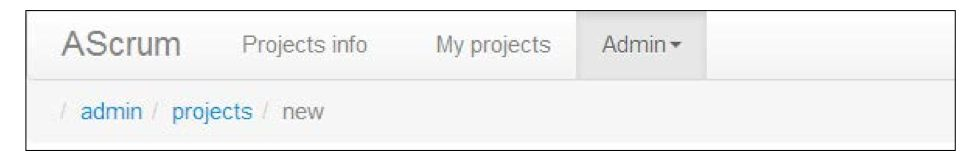

#第四章:显示和格式化数据


---
现在,我们知道如何从后端获取数据到浏览器中,我们可以使用AngularJS专注于显示和操作数据。本章首先概述了AngularJS内置指令使用的模板。一旦基础上我们会看到不同的指令行动和讨论他们的使用模式.
这里页讨论AngularJS过滤器的扩展.

本章你能学到:

*	AngularJS指令的命名约定.
*	解决方案有条件地显示和隐藏的标记块.
*	重复者(`ng-repeat`)指令的使用模式和陷阱.
*	DOM事件处理程序注册,用户可以与应用程序进行交互。
*	AngularJS的基于DOM的模板语言的限制和可能的解决方法.
*	过滤器:他们的目的和使用例子.我们将会重温内置过滤器,
	以及如何创建和测试一个自定义的过滤器.
	

引用指令
===

我们重温不同AngularJS内置指令的例子之前,它是很重要的,我们可以使用各种各样的命名约定来引用指令在HTML标记。

在AngularJS文档中所有的指令都是索引在他们“骆峰式”的名字(比如,`ngModel`).在一个模板中,无论如何,我们需要不仅要使用"蛇式"形式(`ng-model`),冒号分离(`ng:model`)或者下划线分离(`ng_model`)形式.另外,每一个指令的引用是以`x`或者`data`为前缀的.

	每个单个指令都是引用为一系列不同的名字(但是相等).ngModel作为举例,我们能写我们的模板
	用其中的一种: ng-model,ng:model,ng_model,x-ng-model,x-ng:model,x-ng_model,
	data-ng-model,data-ng:model,data-ng_model,x:ng-model,data_ng-model,等等.
	

data前缀是非常容易理解的,保持我们的HTML文档的HTML5的兼容性,使得通过HTML5的验证测试.
否则你可以自由选择任何命名模式;他们都是等价的。

	所有的本书的例子,都是使用最短的"蛇式"格式(比如,ng-model).我们发现这个语法是简洁的和可读的.
	

表达式求值的结果显示
===

AngularJS提供多种方式的渲染数据.净效应总是相同的模型内容显示给用户,但也有值得注意的微妙之处。

插入指令
===

*插入指令*是最基础的指令,处理模型数据的显示,它接受由一对大括号表达式分隔:

	<span>{{expression}}</span>
	
这个指令将对*表达式*求值,呈现其结果在屏幕上。

AngularJS使用的分隔符是可配置的;改变缺省值可能需要AnguarJS配合其他服务端语言模板.
重新配置也是非常简单和归结为用 `$interpolateProvider`设定属性:

```JavaScript

	myModule.config(function($interpolateProvider){ 
		$interpolateProvider.startSymbol('[['); 		$interpolateProvider.endSymbol(']]');
	});
	
```

这里我们将要改变默认的{{ }} 为 [[ ]],所以我们能在模板上这样写:

	[[expression]]
	
	
用ngBind渲染模型值
===

插入指令有个等效的指令叫`ng-bind`. 它能用在一个HTML属性.


	<span ng-bind="expression"></span>

括号格式是非常容易使用,但是有些场合是`ng-bind`指令更顺手些.通常ng-bind指令用于隐藏表达式在AngularJS有机会在页面初始加载处理它们之前.它防止了UI闪烁,提供更好的用户体验.更多的页面初始化优化专题将在*第十二章,打包,部署AngularJS Web应用程序*中详细描述.

AngularJS表达式中的HTML内容
===

默认情况下AngularJS会转义插入指令计算的表达式(模型)中的任何HTML标记.比如,给定的模型:

	$scope.msg = 'Hello, <b>World</b>!';
	
然后是标记片段:

	<p>{{msg}}</p>
	
渲染处理过程会转义<b>标记,所以会出现为普通文本而不是标记:

	<p>Hello, &lt;b&gt;World&lt;/b&gt;!</p>
	
插入指令将会转义在模型中发现的任何HTML内容以阻止HTML注入攻击.


假如,非要这样做,你的模型包含的HTML标记需要通过浏览器计算和渲染,你可以用`ng-bind-html-unsafe`指令去替换默认HTML标记转义:

	<p ng-bind-html-unsafe="msg"></p>
	
使用n`g-bind-html-unsafe`指令,我们会得到浏览器解析的<b>标记的HTML片段.

`ng-bind-html-unsafe`指令应当是在极端条件下使用.这种用法应当是在有限制的案例上,当我们全面信任或者能控制计算后的表达式.否则恶意的用户会注入任意HTML到你的页面上.

AngularJS有更多的指令能有选择的清理特定HTML标记,而允许浏览器计算其他标记:`ng-bind-html`.他的用法和不安全的一样:

	<p ng-bind-html="msg"></p>
	
根据转义`ng-bind-html`指令,它是在n`g-bind-html-unsafe`(允许所有的HTML标记)的行为和`interpolation`指令(不允许HTML标记)之间做了妥协. 这可能个很好的可选案例,有的时候我们允许用户敲入的某些HTML标记.

	ng-bind-html指令存在于一个独立的模块(ngSanitize),
	需要引入附加的源文件:angular-sanitize.js
	
	
假如你要用ng-bind-html指令,不要忘了声明依赖于ngSanitize模块.

```JavaScript

	angular.module('expressionsEscaping',['ngSanitize']) 
		.controller('ExpressionsEscapingCtrl', function ($scope) {
       		$scope.msg = 'Hello, <b>World</b>!';
     	});

```

	除非你工作在已存在的遗留系统(CMS,后端发送HTML,等等),标记在模型中应当是被避免.
	那样的标记不能包含AngularJS指令,需要ng-bind-html-unsafe或者ng-bind-html指令
	去得到想要的结果.
	
	
	

条件显示
===


基于DOM的部分显示和隐藏,在某些条件下是非常有用的需求.在这种场合,AngularJS装备了四种不同的指令集合(`ng-show/ng-hide,ng-switch-*,ng-if`和`ng-include`).

`ng-show/ng-hide`指令家族能用在隐藏(通过应用CSS显示规则)DOM树的部分,基于表达式演算的结果

	<div ng-show="showSecret">Secret</div>
	
前面的代码用ng-hide重新是这样的:

	<div ng-hide="!showSecret">Secret</div>
	
---

	ng-show/ng-hide指令是个简化style="display: none;"隐藏DOM元素的技巧.
	这些元素没有被DOM树移除.

---

如果我们想要有条件地物理移除和增加DOM节点使用`ng-switch`指令家族(`ng-switch,ng-switch-when,ng-switch-default`)很方便:

```html

	<div ng-switch on="showSecret">
		<div ng-switch-when="true">Secret</div>
		<div ng-switch-default>Won't show you my secrets!</div>
	</div>

```


`ng-switch`指令与JavaScript的switch 声明表达非常相似,当我们有多个`ng-switch-when`出现在一个`ng-switch`内部.


	ng-show/ng-hide和ng-switch指令的主要区别就是对待DOM元素的方式.
	ng-switch指令会增加或者移除DOM树中的DOM元素,然而ng-show/ng-hide只会简单应用
	sytle="display: none;" 去隐藏元素.ng-switch指令将会创建一个新的作用域(scope).
	
	
`ng-show/ng-hide`指令是非常容易使用,但是可能在大量的DOM节点上,有不愉快的性能影响.
假如你是关注性能方面相关的DOM树的大小,你应当倾向于使用冗长的`ng-switch`指令家族.

`ng-switch`指令家族的问题就是在简单的使用场景下它的语法是相当啰嗦的.幸运的是AngularJS的兵工厂提供了多个指令:`ng-if` . 它的行为和ng-switch类似(也是在DOM树上增加和删除元素),但是语法要非常简单:

```html

	<div ng-if="showSecret">Secret</div>
```
	


	ng-if指令存在于最新版本的AngularJS:1.1或者1.2.x
	


有条件包含内容块
===

ng-include指令和if/else声明扮演的决策不一样,它用在有条件显示动态块,AngularJS
强大的标记.这个指令有一个非常好的特性. 它能加载和有条件显示基于表达式演算结果的部分.
这允许我们简单地创建高度动态的页面.比如,我们能包含不同用户的编辑表单依赖于用户的角色.
下面的代码片段我们加载不同的部分用户有管理员角色:

```html

	<div ng-include="user.admin && 'edit.admin.html' || 'edit.user.html'"> 
	
	</div>
```

	
		ng-include指令将会创建一个新作用域(scope)给每个包含的部分.
		

附加地,ng-include是个强大的工具,它能用于组合各个小的标记片段为最终的页面.

		ng-include指令接受表达式作为参数,这样你能传递一个引用字符串,
		假如你计划使用一个固定值指向一个局部,比如,<div ng-include="'header.
		tpl.html'"></div>
		
	
ngRepeat指令渲染collections(合集)
===
ng-repeat指令可能是最有常用和最有强大的指令之一.它会遍历一个合集,给合集内的每个实体,冲压出一个新的DOM元素.但是ng-repeat指令不止擅长于简单确认初始化渲染一个合集.它能持续监视来自渲染模板的数据源,在响应发生变化的时候.

		Repeater的实现是高度优化过,将尝试最小化DOM变化,需要的DOM树的数据结构.
		

内部地,ng-repeat指令可以选择移动DOM节点(设想你在数组中移动一个元素),删除一个DOM节点(设想你从数组中删除一个元素),插入新的节点(设想你在数组的尾部加入一个元素).不管一个repeater在背后采用哪种策略,关键是要意识到,这不是一个简单的运行一次for循环。`ng-repeat`指令的行为,更像是一个数据的观察者,它能尝试映射实体到DOM节点的一个合集.数据观察的过程是连续的。

熟悉ngRepeat指令
===
基本用法和语法非常简单:


```html

	<table class="table table-bordered"> 
		<tr ng-repeat="user in users">
	       <td>{{user.name}}</td>
	       <td>{{user.email}}</td>
	    </tr>
	</table>
	
```

这里`users`数组定义在一个作用域和包含常规的用户对象比如属性：`name`，`email`等等。
`ng-repeat`指令会遍历`users`合集和给每个在合集内的实体创建一个`<tr>`DOM元素.

		ng-repeat指令给遍历到的合集内地每一个元素,创建一个新的作用域(scope).
		

特殊变量
===


AngularJS 重复器(repeater)将声明一套特殊变量的集合,在作用域给每个个体实体.
这些变量能用在检查一个元素在合集中位置:

*	$index: 一个数字指向合集内一个元素的索引(从0开始).
*	$first, $middle, $last: 这些变量从元素的位置得到布尔值.

提到的变量来在许多现实生活中非常方便。例如,SCRUM样例应用程序我们可以依靠$last变量来正确地呈现链接导航元素。过去(选择)的一部分路径不需要呈现链接,在<a>元素所需的路径的其他部分。



我们可以对这个UI建模,使用如下的代码:

```html


	<li ng-repeat="breadcrumb in breadcrumbs.getAll()"> 
		<span class="divider">/</span>
		<ng-switch on="$last">
	       <span ng-switch-when="true">{{breadcrumb.name}}</span>
	       <span ng-switch-default>
	         <a href="{{breadcrumb.path}}">{{breadcrumb.name}}</a>
	       </span>
	    </ng-switch>
	</li>
	
```
对象属性的迭代遍历
===


通常ng-repeat指令用于显示的实体,来自一个JavaScript数组。可选地，它能用在遍历一个对象
的属性。这种案例下语法有轻微的不同。


```html

	<li ng-repeat="(name, value) in user">
		Property {{$index}} with {{name}} has value {{value}}
	</li>

```


在之前的例子 ,我们显示所有的user对象的属性为无序列表.


	
	

	


